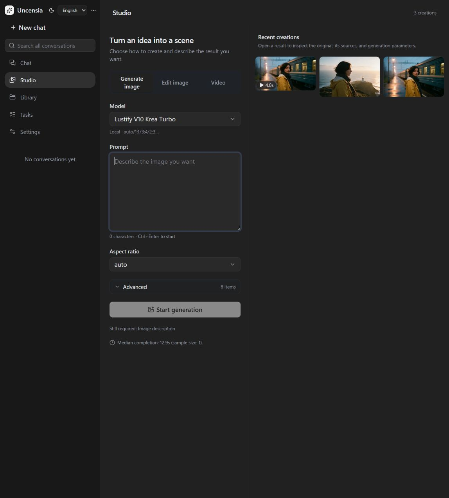

<div align="center">


**A self-hosted AI studio for creative freedom. NSFW-friendly. Your models, from conversation to images and video.**

Your models. Your prompts. Your creative boundaries.

[English](README.md) · [简体中文](README.zh-CN.md) · [Quick start](#quick-start) · [Showcase](#from-an-idea-to-a-moving-scene) · [Documentation](uncensia/docs/README.en.md)


</div>

Uncensia brings a configurable conversational agent, image and video generation, and a media library into one creative workspace. Choose your models, write a story, establish a character, edit the image, and turn it into a shot.

## Why Uncensia

| What you want | What Uncensia focuses on |
|---|---|
| **Creative freedom** | Adult and NSFW-friendly creation, with no additional application-level content filter. An inspectable, editable creative system prompt and your choice of compatible local and cloud models. |
| **An integrated AIGC studio** | Generate through conversation or use the Web Studio directly for images, source-image edits, multi-image composition, and video, with job progress and creation provenance. |
| **Skills for visual continuity** | Carry character, wardrobe, world state, and shot intent across a series. Distinguish source images from references, specify what changes and what stays, and inspect actual results. |
| **A usable client** | Responsive Web UI in English and Chinese. Native iOS: planned; showcase reserved for a future release. |

You choose the provider and model. Connected services still enforce their own content policies; the included prompt does not promise to bypass model restrictions.

## Inside the real Studio



**Generate → edit → animate → reuse.** The creation mode, model parameters, source image, and references are visible in the UI. These screenshots and the examples below come from the same isolated public demo instance.

[Source-image editing UI](uncensia/docs/showcase/web-edit.zh-CN.png) · [Chinese UI](uncensia/docs/showcase/web-studio.zh-CN.png)

## From an idea to a moving scene

**One character. Two locations. A moment in motion.** These are newly generated public demo assets produced through Uncensia’s real generation pipeline, not private conversation exports or mock results.

<table>
<tr><td width="50%"></td><td width="50%"></td></tr>
<tr><td><b>01 · Create a character</b><br/>Lustify V10 Krea Turbo · local ComfyUI</td><td><b>02 · Keep the character, change the scene</b><br/>Seedream 5.0 Pro · reference-based editing</td></tr>
</table>

<div align="center">


**03 · Make the moment move** — Wan 3.0 · image-to-video · 4 seconds · 720p

[Watch the original MP4](uncensia/docs/showcase/03-departure.mp4) · [Prompts, settings, and generation notes](uncensia/docs/showcase/README.md)

</div>

## Continuity takes more than repeating a prompt

- **Series and storyboards:** [image-series](uncensia/skills/image-series/SKILL.md) tracks identity, wardrobe, world state, and shot changes, works toward the requested count, and checks outputs.
- **Edits and composition:** [image-edit](uncensia/skills/image-edit/SKILL.md) and [image-compose](uncensia/skills/image-compose/SKILL.md) specify the source version, reference order, intended changes, and protected details.
- **Still to motion:** [video](uncensia/skills/video/SKILL.md) distinguishes text-to-video from image-to-video, describes motion and timing, and reuses existing creations.

These are readable, editable procedures loaded when needed. They help the agent choose the right source material and generation operation. Visual fidelity still depends on the model; frame-perfect consistency is not guaranteed.

The agent foundation comes from [Pi](https://github.com/badlogic/pi-mono). Memory, knowledge retrieval, MCP, long-running work, and scheduled tasks support the creative workflow. See the [documentation](uncensia/docs/README.en.md) for those capabilities.

## iOS

*Planned. This space is reserved for a future client showcase; no screenshots or download yet.*

## Quick start

Install **Node.js 24 or newer**. A GPU and ComfyUI are only needed for local generation; cloud chat and media use your provider accounts.

```bash
git clone https://github.com/s-JoL/Uncensia.git
cd Uncensia/uncensia
npm ci
npm run build
npm start
```

Open **[127.0.0.1:8090](http://127.0.0.1:8090)**. The server prints the access code in its log. In **Settings → Services**, enter your API keys. Check **Model** and **Tools and permissions** before starting work.

If this Windows machine already has the optional bundled runtime, run this from `uncensia` before the commands above:

```powershell
$env:Path = "$PWD\runtime\node;$env:Path"
```

The runtime, local models, credentials, and personal data are not included in a clone.

### What a fresh installation contains

| Purpose | Default |
|---|---|
| Chat | **HY4 Preview**, through OpenRouter; the only preconfigured chat model |
| Embeddings | **Qwen3 Embedding 8B**, through OpenRouter |
| Image generation | **Lustify V10 Krea Turbo**, through local ComfyUI |
| Image editing | **Seedream 5.0 Pro Spicy**, through Siray |
| Video | **Wan 3.0 Spicy**: text-to-video, first/end-frame, and reference-based profiles |
| Memory and knowledge | **Empty**; no personal memories, conversations, files, or keys |

Only enabled AIGC profiles are seeded. Defaults preserve the configured behavior: memory, hybrid file retrieval, web search, Studio, and workspace read/write/shell tools are enabled. Local generation requires the workflow’s model files; cloud features require their corresponding credentials. Configure the embedding key under **Tools and permissions → Embeddings** and the web-search key there as well. The default workspace is the checkout root and can be changed in Settings.

These are **first-install defaults**. Updating an existing installation keeps its chosen models, disabled entries, memories, credentials, and edited settings.

### English and Chinese

Use **English / 中文** in the sidebar or login screen. The first visit follows your browser language; your choice is saved on that device. Switching language reloads the interface and preserves saved conversation drafts. Save unfinished settings forms before switching. Conversation text, prompts you wrote, and uploaded content are not translated.

The native iOS client includes English and Simplified Chinese resources and follows the app’s preferred language in iOS Settings. It is still under development; the released client is Web.

## Connect the tools you use

- **Models:** OpenAI-compatible Chat and Responses, Anthropic, and Gemini protocols. Select the exact provider and model you want; unavailable selections fail visibly.
- **Media:** ComfyUI workflows and cloud adapters. Studio exposes the selected model’s parameters; completed creations retain their source references.
- **MCP:** Local stdio and remote Streamable HTTP servers become agent tools.
- **Skills:** Ordinary `SKILL.md` procedures loaded on demand. Create or revise them in Settings or through the enabled management tools.
- **Knowledge:** Upload, search, revise, and reuse files. Memory is editable and separate from fictional story context.

## Your data stays in your installation

The default data directory is `uncensia/data/`: SQLite configuration, Pi JSONL conversations, files, media, prompts, skills, and encrypted credentials. Requests still go to the providers you configure.

Stop the service and back up the **whole directory**, including `master.key`, before upgrades. A conversation export is not a full backup. Never run two server instances against the same data directory. [Installation, backup, and updates →](uncensia/docs/README.en.md)

## Development

```bash
cd uncensia
npm run typecheck
npm run audit
npm run build
```

The audits use temporary data and test backends. Real image and video generation is a separate check and may incur provider charges. Start with the [documentation](uncensia/docs/README.en.md), [product scope](uncensia/docs/00-product.md), and [design principles](uncensia/docs/09-design-principles.md).

Uncensia is designed for a personal, self-hosted instance. It is not a multi-tenant hosting platform. Native iOS lives in `uncensia/native-ios` and needs macOS/Xcode validation. Older SQLite conversation formats require an offline conversion before this version can start. Model quality, identity consistency, and long-context recall depend on the selected backend.

### Built on

[Pi](https://github.com/badlogic/pi-mono), [React](https://react.dev/), [Hono](https://hono.dev/), [ComfyUI](https://github.com/Comfy-Org/ComfyUI), and the [Model Context Protocol](https://modelcontextprotocol.io/).
