<div align="center">


# Uncensia

**The uncensored ChatGPT you run yourself.**

Chat about anything, write novels, roleplay, illustrate, edit and animate — with an assistant that learns how you like it.<br/>
Your server, your keys, your rules. On the web and on iPhone. Free and open source.


[简体中文](README.zh-CN.md) · [Quick start](#quick-start) · [What’s new in 1.1](https://github.com/s-JoL/Uncensia/releases/tag/v1.1.0) · [Creative guide](uncensia/docs/guide.en.md) · [Documentation](uncensia/docs/README.en.md)

<br/>

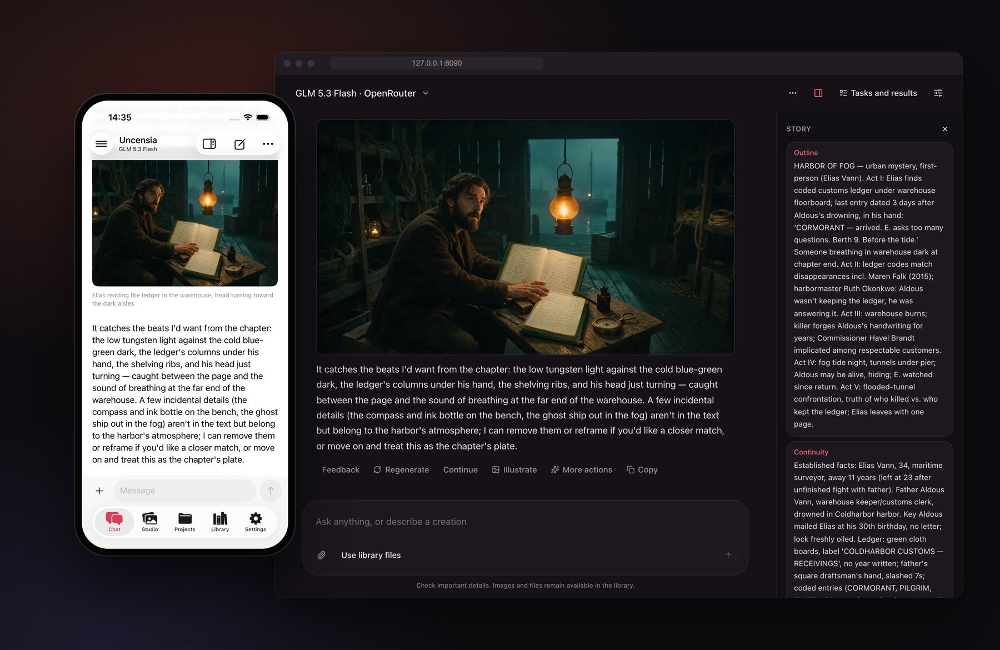

<sub>Real session, nothing staged: GLM 5.3 Flash wrote the chapter and kept the Story notes, Seedream 5.0 Pro drew the scene.</sub>

</div>

## Why Uncensia

- **Talk about anything.** No app-level filter, no blocked words, no refusal prompt bolted on. What a model will write is between you and the provider you choose — and switching models is one tap.
- **Built for making things.** Novels that keep their own outline and continuity, roleplay from the character cards people already share, an *Illustrate* button under every reply, image edits that keep a face, short video from a still.
- **Gets better as you use it.** Correct a reply once and the assistant offers to remember the preference or update one of its skills. Nothing changes until you click.
- **Make it yours without code.** Ask for a button — *“add a Translate button under replies”* — and the assistant builds it as a mod, live, on web and iOS.
- **Everywhere you are.** A desktop web app, an installable phone web app, and a native SwiftUI iPhone app — one server, one history.
- **Actually yours.** Self-hosted and single-user. Conversations, characters and creations live in SQLite and a folder on your disk. No telemetry, no account with us.

## Quick start

Install **Node.js 24+**, then:

```bash
git clone https://github.com/s-JoL/Uncensia.git
cd Uncensia/uncensia
npm ci && npm run build && npm start
```

1. Open [127.0.0.1:8090](http://127.0.0.1:8090) and sign in with the access code printed in the server log.
2. In **Settings → Services**, paste an [OpenRouter](https://openrouter.ai/) key and press **Test** — one tiny real request proves it works. That is enough to chat, write and roleplay.
3. Add a [Siray](https://siray.ai/) key for images and video, or point Uncensia at your own [ComfyUI](https://github.com/Comfy-Org/ComfyUI) GPU.

On a phone, open the same address and choose *Add to Home Screen*. [Background service, remote access, updates and backup →](uncensia/docs/README.en.md)

## Write a novel that remembers itself

Say *“let’s write a mystery”*. The assistant drafts an outline, then keeps three short notes as the story grows — **Outline** (the arc and where you are in it), **Continuity** (names, injuries, who knows what, the timeline) and **Style** (the voice you settled on) — and shows them in the Story panel beside the manuscript, so chapter twelve can still honour what happened in chapter two.

Under every reply: **Keep writing**, **Rewrite**, and **Illustrate**, which turns that passage into a picture right there in the story. Export the whole conversation as Markdown when you are done.

<p align="center">
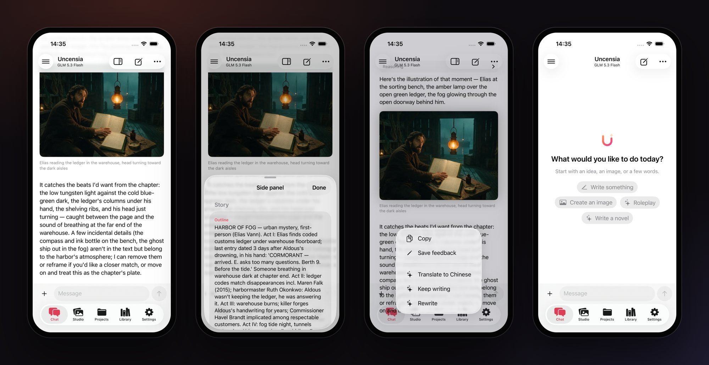
</p>

## Roleplay with the cards you already have

Drop in a character card — **PNG** (`chara` / `ccv3`) or JSON, V1 to V3 — preview what it contains, and start. The opening message and lorebook come along. Or skip setup entirely and just describe the scene. Roleplay is a way of talking here, not a separate mode: ask an ordinary question mid-scene and you get an ordinary answer, then you are back in the story.

## It learns — and asks first

<p align="center">
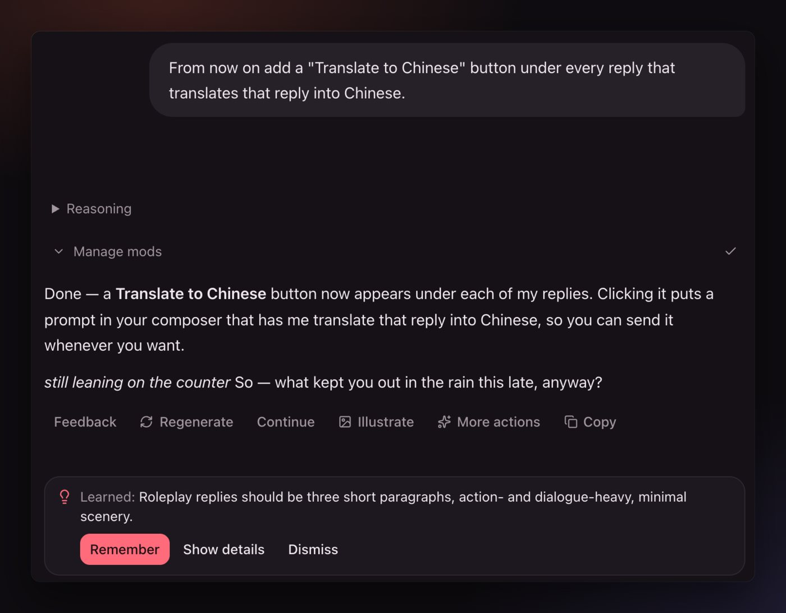
</p>

After a reply you corrected, regenerated or left feedback on, the assistant proposes **one** thing worth keeping: a preference to remember, a new skill, a fix to an existing skill, or a mod. You see it in plain words under the reply — *Remember*, *Show details*, or *Dismiss*. Everything it learns is versioned and can be restored in one click from Settings.

## Mods: change the app by asking

A mod adds buttons under replies, starting suggestions for a new chat, or a side panel that shows the notes the assistant keeps. Mods are small declarations that run no code, so the assistant can write one safely when you ask. The bundled **Creative kit** gives you the novel and roleplay starters, *Keep writing*, *Rewrite*, and the Story and Scene panels.

<p align="center">
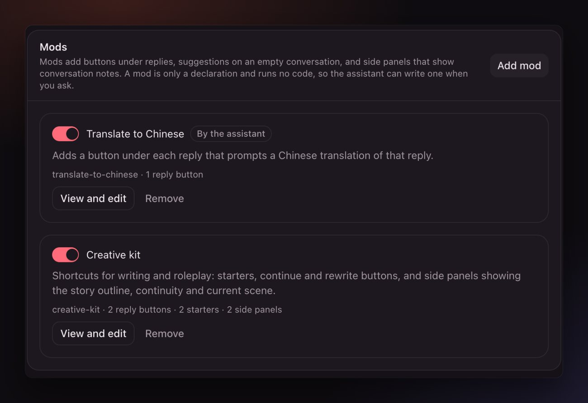
</p>

## A real agent behind the chat

The assistant searches the web and your library, remembers facts across conversations, calls MCP tools, generates and edits images and video, and can keep a task going on a schedule while you are away. Skills — the procedures it follows for fiction, roleplay, image series and more — are plain files you can read and edit. File and command tools are **developer tools**, off until you turn them on, and destructive actions still pause for your approval.

## Made with Uncensia

Every image below is a **real output** of Uncensia’s own pipeline — same models, same job queue — with prompts, model IDs and SHA-256 hashes in [the production notes](uncensia/docs/showcase/README.md).

<table>
<tr>
<td width="25%">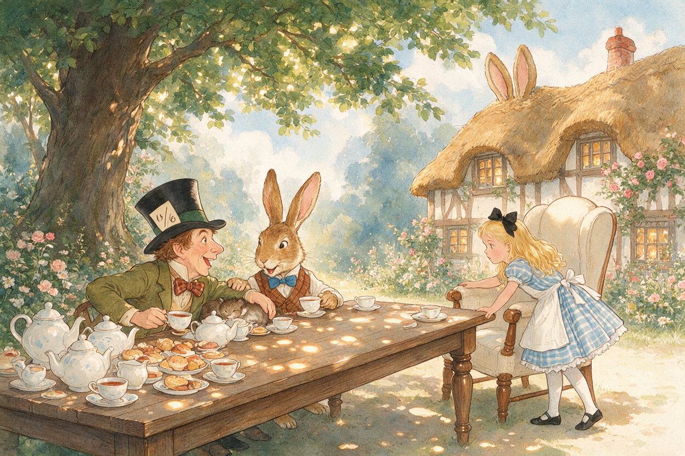</td>
<td width="25%"></td>
<td width="25%"></td>
<td width="25%">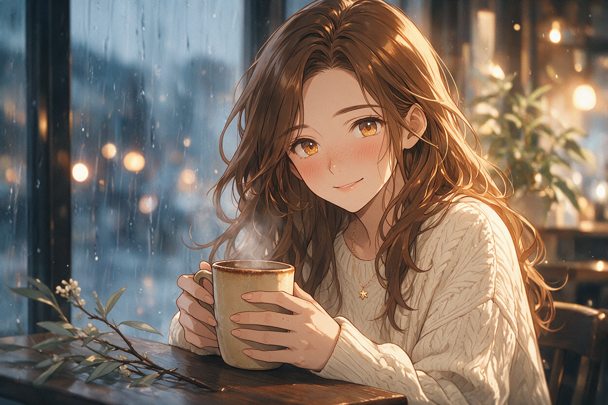</td>
</tr>
<tr>
<td align="center">Storybook watercolour</td>
<td align="center">Victorian oil</td>
<td align="center">Photoreal film</td>
<td align="center">Soft anime</td>
</tr>
</table>

### One character, scene after scene

One text-to-image job sets the scene; two *edits of that first image* move the moment and change the setting — while Holmes and Watson stay recognisably themselves. This visual continuity is the hard part of illustrating anything longer than one picture.

<table>
<tr>
<td width="33%">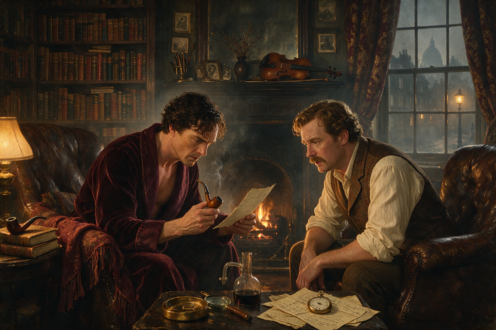</td>
<td width="33%"></td>
<td width="33%"></td>
</tr>
<tr>
<td><b>1.</b> Text-to-image: 221B Baker Street.</td>
<td><b>2.</b> Same room, Holmes rises with the magnifier.</td>
<td><b>3.</b> Same two men, out into the fog.</td>
</tr>
</table>

### A companion who stays the same person

Design a character once and keep her across moods, outfits and places — face, freckles and little star necklace carried from a rainy café to a neon street to a quiet evening at home. Then hand the model **two** portraits and it composes both people into one new scene.

<table>
<tr>
<td width="20%"></td>
<td width="20%">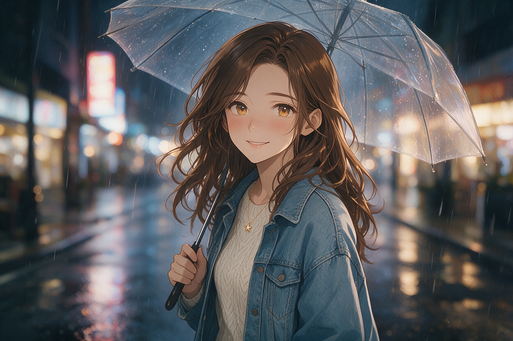</td>
<td width="20%">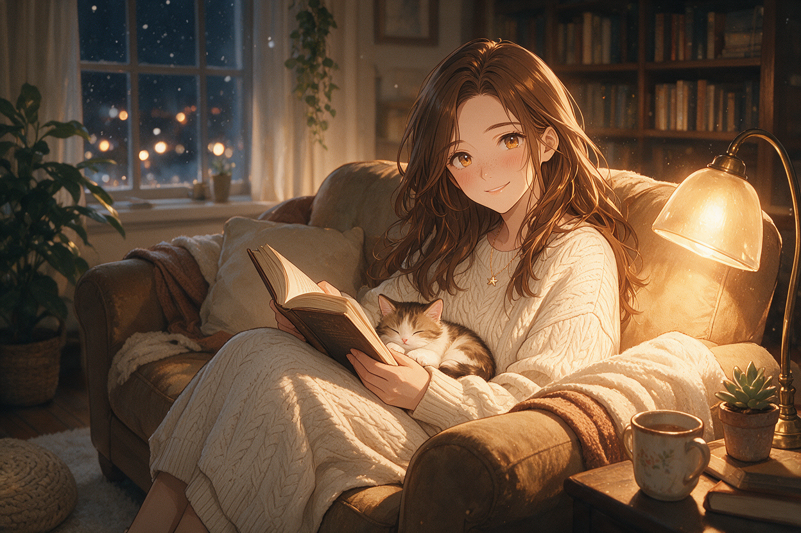</td>
<td width="40%"></td>
</tr>
<tr>
<td>Rainy café.</td>
<td>A neon night out.</td>
<td>Home for the evening.</td>
<td><b>Composed</b> with a second portrait.</td>
</tr>
</table>

### Illustrate a book, then fix what is wrong

Upload a public-domain novel, ask for a chapter, illustrate it. When the first watercolour of the Mad Tea-Party came back with **two** pocket watches, one edit — *“keep a single watch, held to the Hatter’s ear”* — fixed the prop without redrawing the scene.

<table>
<tr>
<td width="25%"></td>
<td width="25%">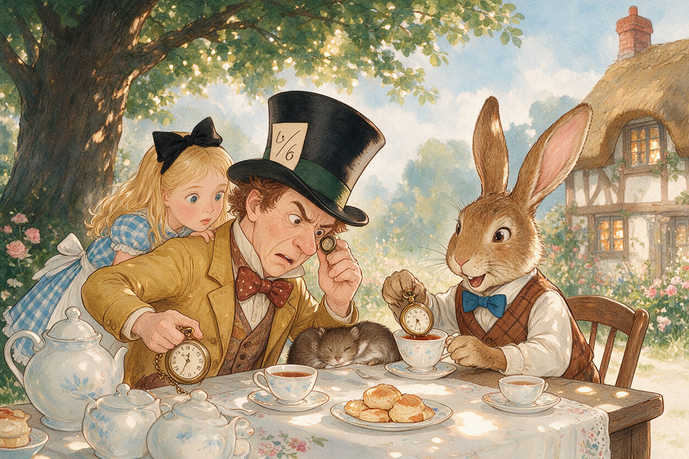</td>
<td width="25%">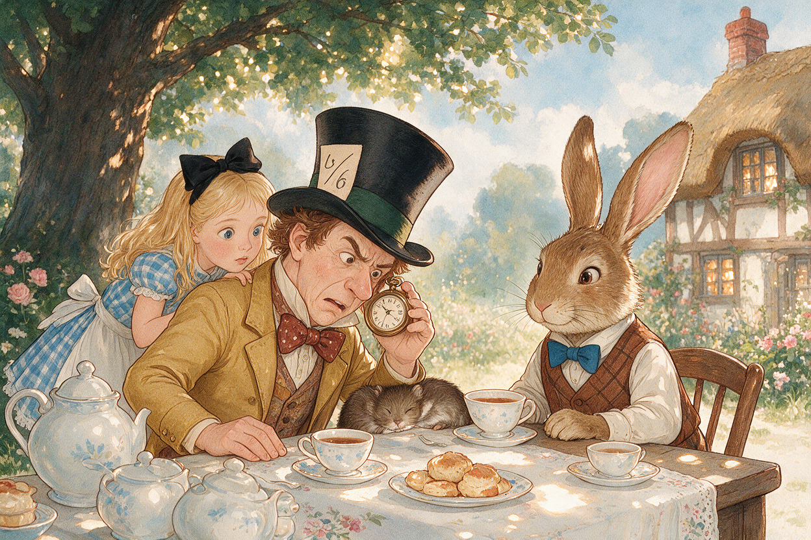</td>
<td width="25%">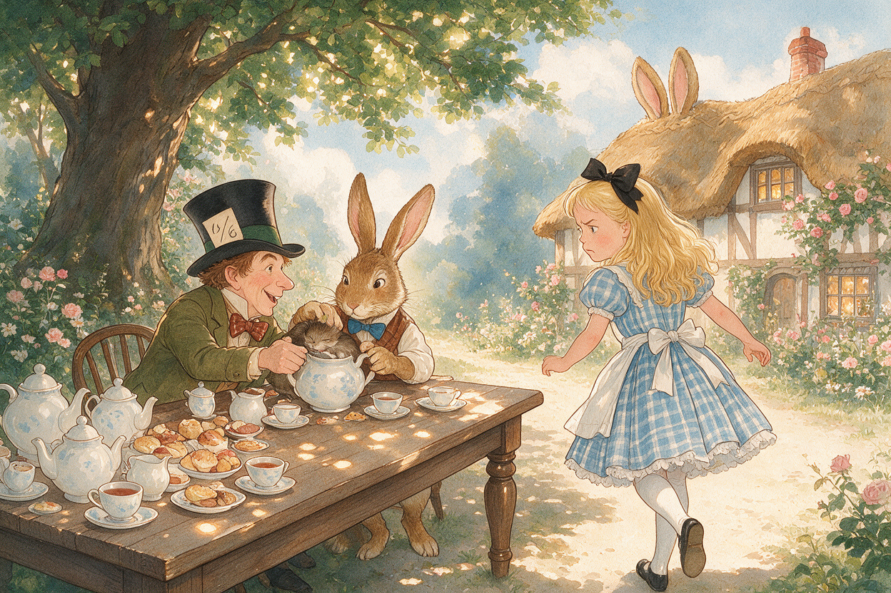</td>
</tr>
<tr>
<td>Find the scene, illustrate it.</td>
<td>First try: an extra watch.</td>
<td>One edit later: fixed.</td>
<td>On to the next beat.</td>
</tr>
</table>

### From a still to a moving shot

A portrait on a local ComfyUI GPU, relocated with an image edit, then animated with image-to-video — all from the same library.

<p align="center">
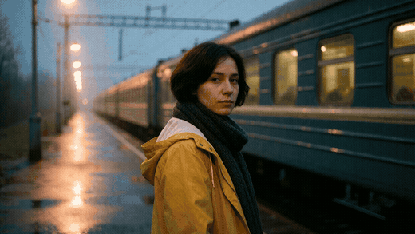
</p>

## Bring your own models

A fresh install comes with a working set; add keys in **Settings → Services** and switch anything, any time.

| Role | Default | Where |
|---|---|---|
| Chat | **GLM 5.3 Flash** (default), **DeepSeek V4.1 Flash**, **MiMo V2.6 Flash** — all can see images | OpenRouter (your key) |
| Images — generate, edit, compose | **Seedream 5.0 Pro** | Siray (your key) |
| Video | **Wan 3.0** | Siray (your key) |
| Images — local | **Lustify V10 Krea Turbo** | your own ComfyUI |

Any OpenAI-, Anthropic- or Gemini-compatible endpoint, and any ComfyUI workflow, can be added. Pin the few models you use most so they are one tap away.

## How it compares

There are excellent tools next door; each stops short of the whole.

- **General chat front-ends** (Open WebUI, LobeChat, LibreChat, Cherry Studio) are great for chat, but generation is an add-on, there is no roleplay or visual continuity, and on the phone you get a web page.
- **Roleplay front-ends** (SillyTavern, RisuAI) go deep on characters, but have no tool-using agent, treat generation as an extension, and have no native iPhone app.
- **Hosted companion apps** are polished, but hosted, filtered, and not yours.

Uncensia sits where none of them do: **a private, unrestricted, bring-your-own-model ChatGPT with a real agent, illustrated writing and roleplay, images and video that stay consistent, and an assistant that improves with use — on the web and native iOS.** It is deliberately single-user; that focus is the point.

## FAQ

**Do I need a GPU?** No. With an OpenRouter key (and a Siray key for media) everything runs in the cloud. A local ComfyUI GPU is optional.

**What does it cost?** Uncensia is free and MIT-licensed. You pay your providers for what you use, at their prices.

**Is it really uncensored?** Uncensia adds no filter, safety LoRA, blocked-word list or refusal prompt of its own. Each provider still enforces its own policy, and you are responsible for how you use it.

**Where does my data go?** Into `uncensia/data/` on your machine, and to the model providers you configure — nowhere else. Back up the whole directory, including `master.key`.

**Can I use it on my phone?** Yes: *Add to Home Screen* installs the web app, or build the native iPhone app in Xcode ([guide](uncensia/docs/15-ios-native.md), in Chinese). It is not on the App Store. Away from home, put the server behind a tunnel or reverse proxy you trust.

**Can several people share one instance?** No. One person owns an instance; projects organise material, they are not permission boundaries.

## Development

```bash
cd uncensia
npm run typecheck
npm run audit
npm run build
```

Start with the [product scope](uncensia/docs/00-product.md) and the [documentation index](uncensia/docs/README.en.md). The iOS app builds in Xcode from `uncensia/native-ios`; real-provider generation is validated separately from the automated checks.

Built on [Pi](https://github.com/earendil-works/pi), [React](https://react.dev/), [Hono](https://hono.dev/), [ComfyUI](https://github.com/Comfy-Org/ComfyUI) and [MCP](https://modelcontextprotocol.io/). MIT licensed.
