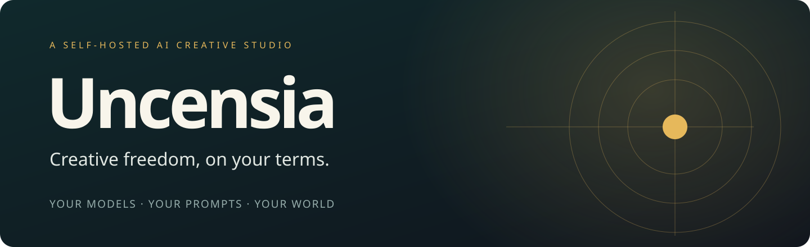
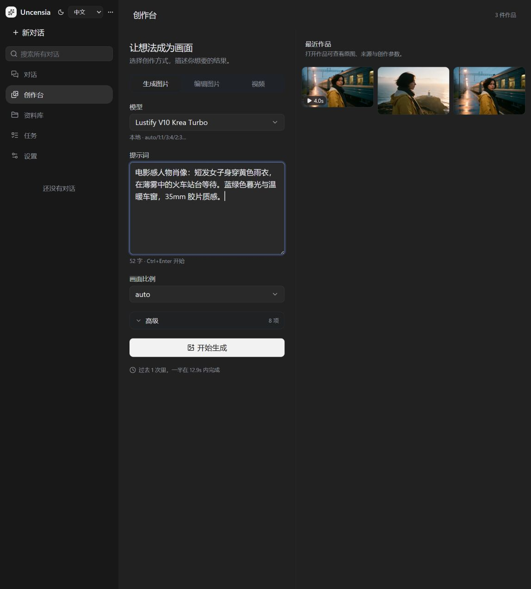

<div align="center">



**面向自由创作的自托管 AI 工作室。支持 NSFW，自选模型，从对话到图片与视频。**

你的模型，你的提示词，你的创作尺度。

[English](README.md) · [简体中文](README.zh-CN.md) · [快速开始](#快速开始) · [AIGC 展示](#从一个想法到一段镜头) · [文档](uncensia/docs/README.md)


</div>

Uncensia 把可自主配置的对话 agent、图片与视频生成、作品管理放在同一个创作空间里。选择适合自己的模型，写故事、建立角色、编辑画面，再把它变成镜头。

## 为什么选择 Uncensia

| 你想要的 | Uncensia 的侧重点 |
|---|---|
| **自由创作** | 支持成人向与 NSFW 创作；应用层不额外叠加内容过滤。自带可查看、修改和替换的创作 system prompt，自由接入兼容的本地与云端模型。 |
| **完整 AIGC 创作台** | 对话中调用生成工具，也可直接在 Web 创作台生成图片、编辑原图、多图合成、生成视频，查看进度与作品来源。 |
| **针对连续创作的技能** | 围绕人物、服装、场景状态和镜头组织生成；区分原图与参考图，明确保留项和修改项，并检查实际结果。 |
| **客户端体验** | 现有 Web 界面支持桌面与移动端、中英文。原生 iOS：规划中，展示位暂留空。 |

接入哪家服务、使用哪个模型，由你选择。外部模型与服务自身的内容政策仍然生效；预设提示词不承诺绕过任何模型的限制。

## 看看真实创作台



**生成 → 编辑 → 视频 → 作品复用。** 创作方式、模型参数、原图和参考图都在界面里可见。下方示例与截图来自同一个隔离的公开演示实例。

[查看原图编辑界面](uncensia/docs/showcase/web-edit.zh-CN.png) · [查看英文界面](uncensia/docs/showcase/web-studio.png)

## 从一个想法，到一段镜头

**同一个人物，两个场景，一段动态瞬间。** 下面是通过 Uncensia 真实生成流程新制作的公开演示素材，不是私人对话导出，也不是模拟结果。

<table>
<tr><td width="50%"></td><td width="50%"></td></tr>
<tr><td><b>01 · 创造人物</b><br/>Lustify V10 Krea Turbo · 本地 ComfyUI</td><td><b>02 · 保留人物，改变场景</b><br/>Seedream 5.0 Pro · 参考图编辑</td></tr>
</table>

<div align="center">


**03 · 让这个瞬间动起来** — Wan 3.0 · 图生视频 · 4 秒 · 720p

[观看原始 MP4](uncensia/docs/showcase/03-departure.mp4) · [提示词、参数与制作说明](uncensia/docs/showcase/README.zh-CN.md)

</div>

## 连续创作不只是反复发送提示词

- **系列图与分镜**：[image-series](uncensia/skills/image-series/SKILL.md) 维护人物身份、服装、世界状态和镜头变化，按约定数量生成，并检查输出。
- **改图与合成**：[image-edit](uncensia/skills/image-edit/SKILL.md) 与 [image-compose](uncensia/skills/image-compose/SKILL.md) 明确原图版本、参考图顺序、修改目标及需要保留的细节。
- **从静帧到视频**：[video](uncensia/skills/video/SKILL.md) 区分文生视频与图生视频，围绕运动、镜头和时间组织描述，复用已有作品。

这些技能是可读、可改的流程文件，按需加载；它们帮助 agent 使用正确的素材和生成方式。最终一致性仍取决于模型能力，不保证每一帧完全一致。

底层沿用 [Pi](https://github.com/badlogic/pi-mono) 的 agent 能力。记忆、知识检索、MCP、长任务和定时任务作为创作的配套能力保留，详细用法见[文档](uncensia/docs/README.md)。

## iOS

*规划中。此处保留客户端演示位置，暂不提供截图或下载。*

## 快速开始

安装 **Node.js 24 或更新版本**。只有本地生成需要显卡和 ComfyUI；云端对话与媒体生成使用你的服务商账号。

```bash
git clone https://github.com/s-JoL/Uncensia.git
cd Uncensia/uncensia
npm ci
npm run build
npm start
```

打开 **[127.0.0.1:8090](http://127.0.0.1:8090)**，访问码会打印在服务端日志中。在 **设置 → 连接服务** 填入 API 密钥，开始前检查 **模型** 与 **工具与权限**。

如果这台 Windows 机器已经装有可选的内置运行时，在 `uncensia` 目录先执行：

```powershell
$env:Path = "$PWD\runtime\node;$env:Path"
```

运行时、本地模型、密钥和个人数据都不会随仓库提供。

### 新安装的默认配置

| 用途 | 默认值 |
|---|---|
| 对话 | OpenRouter 的 **HY4 Preview**，唯一预置对话模型 |
| 向量检索 | OpenRouter 的 **Qwen3 Embedding 8B** |
| 生图 | 本地 ComfyUI 的 **Lustify V10 Krea Turbo** |
| 图片编辑 | Siray 的 **Seedream 5.0 Pro Spicy** |
| 视频 | **Wan 3.0 Spicy**：文生视频、首尾帧和多参考配置 |
| 记忆与知识 | **空白**，不带个人记忆、对话、文件或密钥 |

仅预置已启用的 AIGC 配置。其余行为沿用现有默认：启用记忆、混合文件检索、网页搜索、创作台，以及工作目录读写和命令执行工具。本地生成需要安装工作流对应模型；云端能力需要填写相应凭据。向量密钥在 **工具与权限 → 嵌入** 中填写，网页搜索密钥也在该设置页。工作目录默认为仓库根目录，可以在设置中更改。

这些是**首次安装默认值**。更新已有安装会保留选定模型、停用项目、记忆、密钥和修改过的设置。

### 中文与英文

在侧栏或登录页选择 **English / 中文**。初次打开跟随浏览器语言，手动选择保存在当前设备。切换会重新加载界面，并保留已保存的对话草稿；未保存的设置表单请先保存。对话正文、自写提示词和上传内容不会被翻译。

原生 iOS 客户端包含英文和简体中文资源，跟随 iOS 设置中的应用首选语言。它仍在开发中，当前发布界面是 Web。

## 接入自己的工具

- **模型**：OpenAI 兼容 Chat 与 Responses、Anthropic、Gemini 协议。明确选择服务和型号；指定模型不可用时直接显示错误。
- **媒体**：ComfyUI 工作流和云端适配器。创作台展示当前模型的参数，成品保留来源引用。
- **MCP**：本地 stdio 和远程 Streamable HTTP 服务可作为 agent 工具。
- **技能**：普通 `SKILL.md` 文件，按需读取。可以在设置中创建、编辑，也可以使用已启用的管理工具。
- **知识**：上传、检索、修订和复用文件；可编辑的个人记忆与虚构故事设定分开保存。

## 数据保存在自己的安装中

默认数据目录是 `uncensia/data/`，包含 SQLite 配置、Pi JSONL 对话、文件、媒体、提示词、技能和加密凭据。模型请求仍会发往你配置的服务商。

升级前停服务，备份**整个目录**，包括 `master.key`。对话导出不是完整备份。不要让两个服务实例同时写同一个数据目录。[安装、备份与更新 →](uncensia/docs/12-operations.md)

## 开发

```bash
cd uncensia
npm run typecheck
npm run audit
npm run build
```

自动检查使用临时数据和测试后端；真实出图、视频生成需要单独验证，可能产生服务商费用。修改前从[文档导航](uncensia/docs/README.md)、[产品范围](uncensia/docs/00-product.md)和[设计原则](uncensia/docs/09-design-principles.md)开始。

Uncensia 面向个人自托管，不是多租户平台。原生 iOS 位于 `uncensia/native-ios`，需要 macOS/Xcode 验收。旧 SQLite 对话格式需要先离线转换才能启动新版。写作质量、人物一致性和长上下文召回取决于所选后端。

### 基于这些项目构建

[Pi](https://github.com/badlogic/pi-mono)、[React](https://react.dev/)、[Hono](https://hono.dev/)、[ComfyUI](https://github.com/Comfy-Org/ComfyUI) 与 [Model Context Protocol](https://modelcontextprotocol.io/)。
