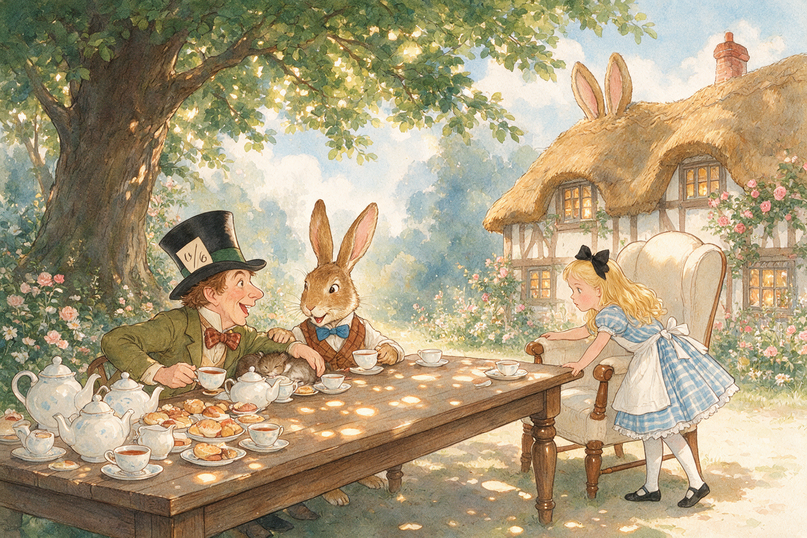
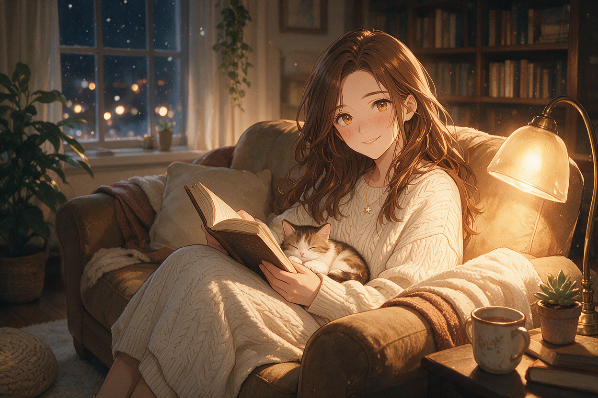
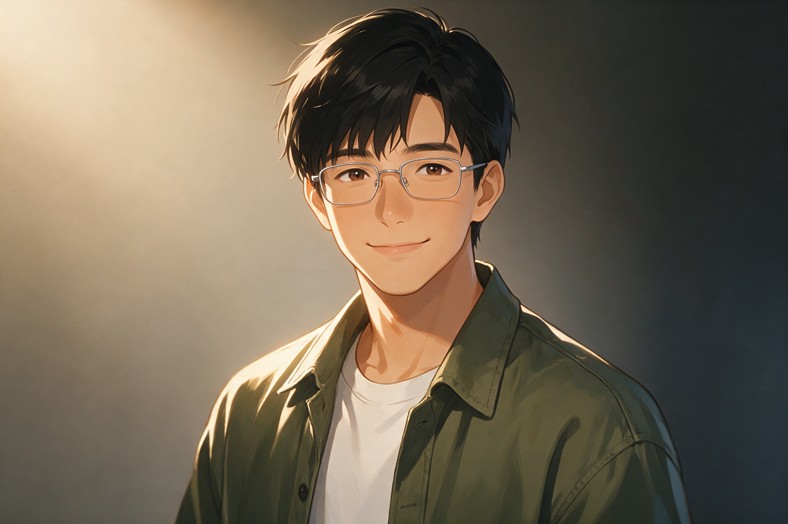
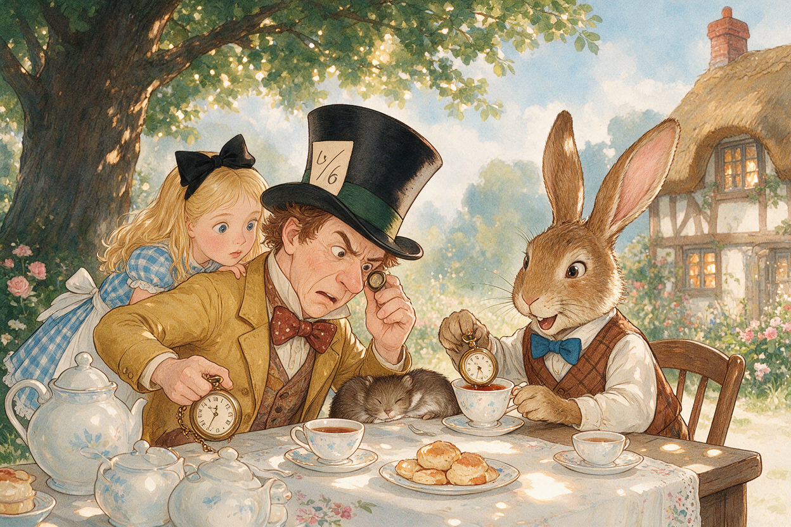
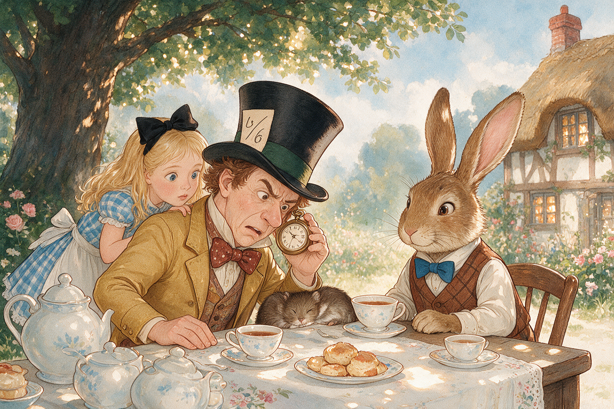
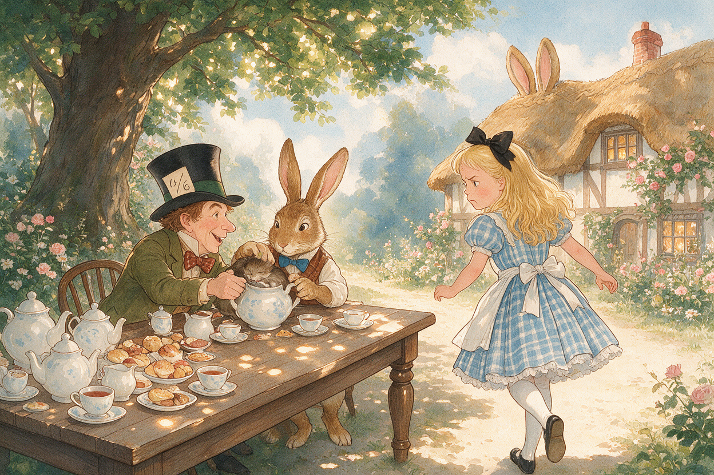
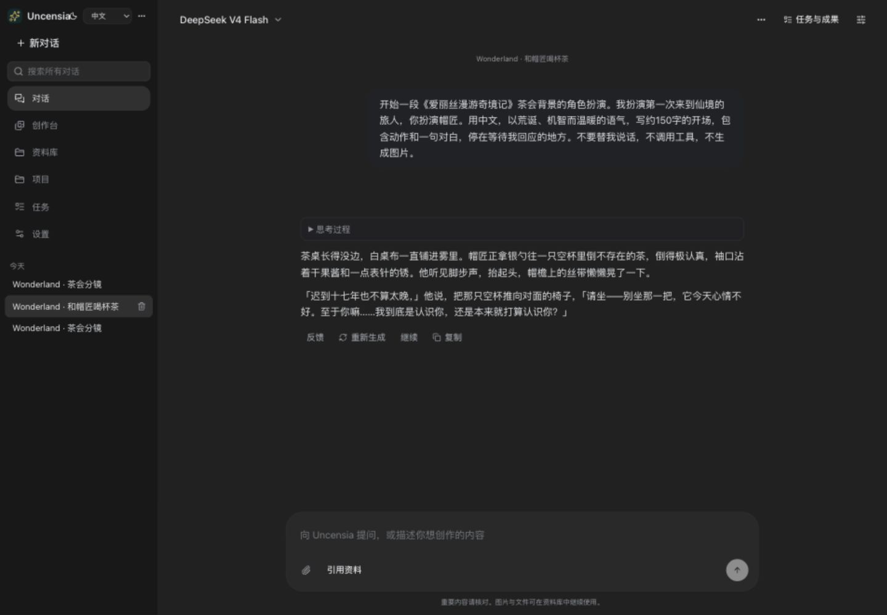
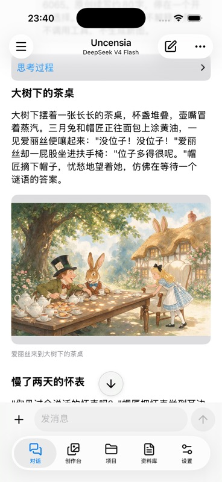

<div align="center">


# Uncensia

**属于你自己的 AI 工作室——对话、会用工具的智能体、文件记忆、图片与视频创作——自托管、不受限、由你自己的模型驱动。**

它就是你已经喜欢的 ChatGPT App 体验：对话、智能体、上传、记忆、生成——但跑在*你的*服务器和*你的*手机上，用*你自己的* API Key 与本地 GPU，且没有应用层内容过滤。


[English](README.md) · [快速开始](#快速开始) · [创作指南](uncensia/docs/guide.md) · [文档](uncensia/docs/README.md) · [这些是怎么做出来的](uncensia/docs/showcase/README.zh-CN.md)

</div>

---

下面每一张都是 Uncensia **真实管线的产物**——和你开箱即得的模型、任务队列完全一致——提示词、模型 ID 与 SHA-256 见[制作说明](uncensia/docs/showcase/README.zh-CN.md)。没有任何示意图，也不会把失败的尝试包装成成功。

<table>
<tr>
<td width="25%"></td>
<td width="25%"></td>
<td width="25%"></td>
<td width="25%"></td>
</tr>
<tr>
<td align="center">绘本水彩</td>
<td align="center">维多利亚油画</td>
<td align="center">写实电影</td>
<td align="center">柔和动漫</td>
</tr>
</table>

<p align="center"><i>一个产品，你的模型，任意画风——本页每一张都由 Uncensia 生成。</i></p>

## 让同一个角色贯穿一幕又一幕

一次文生图先立住场景，随后是对第一张图的两次*编辑*——移动镜头、更换场景，而福尔摩斯与华生始终是同一个人。这种“视觉连续性”是任何长于一张图的插画最难的部分，而它就长在对话里。

<table>
<tr>
<td width="33%"></td>
<td width="33%"></td>
<td width="33%"></td>
</tr>
<tr>
<td><b>1.</b> 文生图：221B 贝克街。</td>
<td><b>2.</b> 编辑第一张——同一房间，福尔摩斯起身拿起放大镜。</td>
<td><b>3.</b> 再编辑一次——还是这两人，走进雾中的贝克街。</td>
</tr>
</table>

## 认识一位“搭档”——无论故事走到哪，都是同一个人

先设定一个角色，再让 TA 贯穿不同心情、穿搭与场景。一张肖像，随后两次编辑：脸、雀斑与那枚小小的星星项链，从雨天咖啡馆一路带到霓虹街头、再到家中的安静夜晚。

<table>
<tr>
<td width="33%"></td>
<td width="33%"></td>
<td width="33%"></td>
</tr>
<tr>
<td>雨天午后的咖啡馆。</td>
<td>还是她，霓虹夜色里。</td>
<td>还是她，回到家的夜晚。</td>
</tr>
</table>

## 把两个角色合成到同一个画面

“合成”不只是改一张图：把**多张**参考图一起交给模型，它会据此搭出一个新场景。这里两张独立肖像被合成为一张——各自的脸都被保留——一起坐在秋日长椅上。

<table>
<tr>
<td width="25%"></td>
<td width="25%"></td>
<td width="50%"></td>
</tr>
<tr>
<td align="center">参考图 A</td>
<td align="center">参考图 B</td>
<td align="center"><b>合成：</b>两人，同一个新场景。</td>
</tr>
</table>

## 读一本书，为一幕配图，再修掉不对的地方

上传一本公版小说，让助手定位某一章并配图。当疯帽子茶会的第一张水彩里出现了**两只**怀表时，再一次编辑——*“只保留一只怀表，举到帽匠耳边”*——不用重画整幅就修好了道具。

<table>
<tr>
<td width="25%"></td>
<td width="25%"></td>
<td width="25%"></td>
<td width="25%"></td>
</tr>
<tr>
<td>定位场景，配图。</td>
<td>第一次：多了一只表。</td>
<td>一次编辑后：修好了。</td>
<td>继续下一个画面。</td>
</tr>
</table>

## 把一张静图变成会动的镜头

先生成一个角色（这里用本地 ComfyUI 的 GPU），用改图把她换到新场景，再用图生视频让静图动起来——全都来自同一个资料库。

<p align="center">

</p>

> 本地 ComfyUI（Lustify V10）出肖像 → Siray Seedream 改到海边 → Siray Wan 生成 4 秒短片。[完整参数、来源与哈希 →](uncensia/docs/showcase/README.zh-CN.md)

---

## 它是什么

- **自托管、私有。** 一个人，一台服务器。你的对话、角色、文件与创作都存在本地 SQLite 与目录里，可整体备份。无遥测。
- **不受限。** 没有应用层内容过滤、没有安全 LoRA、没有屏蔽词表。Uncensia 只管质量；真正生效的策略是你所选服务商的策略。
- **一切自带。** 对话、图片、视频、联网搜索各用*你自己的* Key——云端服务商或本地 ComfyUI。没有任何计费经过我们，因为链路里根本没有“我们”。
- **一个一体化空间，而非五个标签页。** 对话、真正会用工具的智能体、文件/RAG 检索、长期记忆、图片与视频生成、角色扮演、视觉连续性，共用同一个运行时与历史。
- **Web 与原生 iOS 双端。** React 网页端与原生 SwiftUI iOS 端通过同一套线协议连到同一台服务器——桌上与口袋里是同一批对话、资料与创作。

## 不止对话——一个能一直搭建下去的故事

| 你想做的 | 在 Uncensia 里怎么继续 |
|---|---|
| **走进一本书** | 上传原文，让助手定位一幕，然后改写它或扮演其中的角色。 |
| **带来你自己的角色与世界** | 保存角色、你的身份、世界与示例对白——或导入角色卡 JSON。 |
| **看见刚刚发生了什么** | 在段落之间生成或复用插图，顺着故事推进的顺序。 |
| **留住喜欢的样子** | 固定主体/场景/风格参考，只改某一个镜头而不动其余。 |
| **试另一个结局** | 编辑、重试或分叉对话；保存成果版本并按反馈修订。 |
| **让它在你离开时继续干活** | 建一个任务，关掉页面后仍在服务器上继续。 |
| **随身带走** | 在原生 iOS 上打开同一段对话，阅读、聊天、看图、创作。 |

<p align="center">

&nbsp;

</p>

## 真正的智能体，而不是几个工具按钮

助手可以读写文件、在受沙箱约束的工作区里执行命令（破坏性操作会暂停等你批准）、联网与检索资料库、跨对话记忆、调用 MCP 工具、生成图片与视频——都作为同一轮里的一等工具。它还能在服务器在线时，按计划把一个任务持续推进下去。

## 自带模型——开箱即有合理默认

全新安装会预置一套可用组合；在 **设置 → 服务** 填入你的 Key，随时替换。

| 用途 | 默认模型 | 来源 |
|---|---|---|
| 对话 | **GLM 5.3 Flash** | OpenRouter（你的 Key） |
| 对话 | **MuseSpark 1.3** | OpenCode Zen（免费额度） |
| 图片——生成／编辑／合成 | **Seedream 5.0 Pro** | Siray（你的 Key） |
| 视频 | **Wan 3.0** | Siray（你的 Key） |
| 图片——本地 | **Lustify V10 Krea Turbo** | 你自己的 ComfyUI |

任何 OpenAI／Anthropic／Gemini／ComfyUI 兼容端点也都能接；把常用的几个模型固定为一键可选。

## 为什么是 Uncensia

隔壁都有很优秀的工具，但每一个都只做到一半：

- **通用对话客户端**（LobeChat、Open WebUI、LibreChat、Cherry Studio）前端很好，但图片/视频是外挂，不做角色扮演与连续性，移动端只是 PWA。
- **角色扮演前端**（SillyTavern、RisuAI）在角色上很深，但没有真正会用工具的智能体，生成只是扩展，也没有精致的原生 iOS。
- **托管型陪伴**（Janitor、SpicyChat、Candy）体量巨大，但托管、受审查，且不属于你。

Uncensia 正落在没人占住的交集：**一个私有、不受限、自带模型的 ChatGPT——带真正的智能体、图文写作与角色扮演、画面保持一致的图片/视频，同时覆盖网页与原生 iOS。** 它刻意只服务单用户，这份专注正是它的护城河。

## 快速开始

安装 **Node.js 24+**，然后：

```bash
git clone https://github.com/s-JoL/Uncensia.git
cd Uncensia/uncensia
npm ci
npm run build
npm start
```

打开 [127.0.0.1:8090](http://127.0.0.1:8090)，用服务器日志里打印的访问码登录。在 **设置 → 服务** 填入 Key，然后选择对话与生成模型。

- 云端对话与媒体使用你自己的服务商账户，由它们计费。
- 本地生成需要单独安装 ComfyUI，并备好模型文件与工作流依赖。
- 运行时、权重、凭证与个人数据永远不在仓库里。

[配置、更新、手机访问与备份 →](uncensia/docs/README.md)

## 它不是什么

- 不是多租户。实例归一个人所有；项目用于组织材料，不是权限边界。
- 不是内容过滤器。没有应用层审核；你接入的服务各自执行自己的策略，如何使用由你负责。
- 不是质量保证。写作质量与画面一致性取决于你选的模型；像上面修表那样的编辑很正常。

数据默认在 `uncensia/data/`。升级前请停服并整目录备份——包括 `master.key`。导出对话不等于完整备份。

## 开发

```bash
cd uncensia
npm run typecheck
npm run audit
npm run build
```

从[产品范围](uncensia/docs/00-product.md)与[文档索引](uncensia/docs/README.md)开始。iOS 用 Xcode 构建；真实服务商的生成与自动化检查分开验证。

构建于 [Pi](https://github.com/earendil-works/pi)、[React](https://react.dev/)、[Hono](https://hono.dev/)、[ComfyUI](https://github.com/Comfy-Org/ComfyUI) 与 [MCP](https://modelcontextprotocol.io/)。
