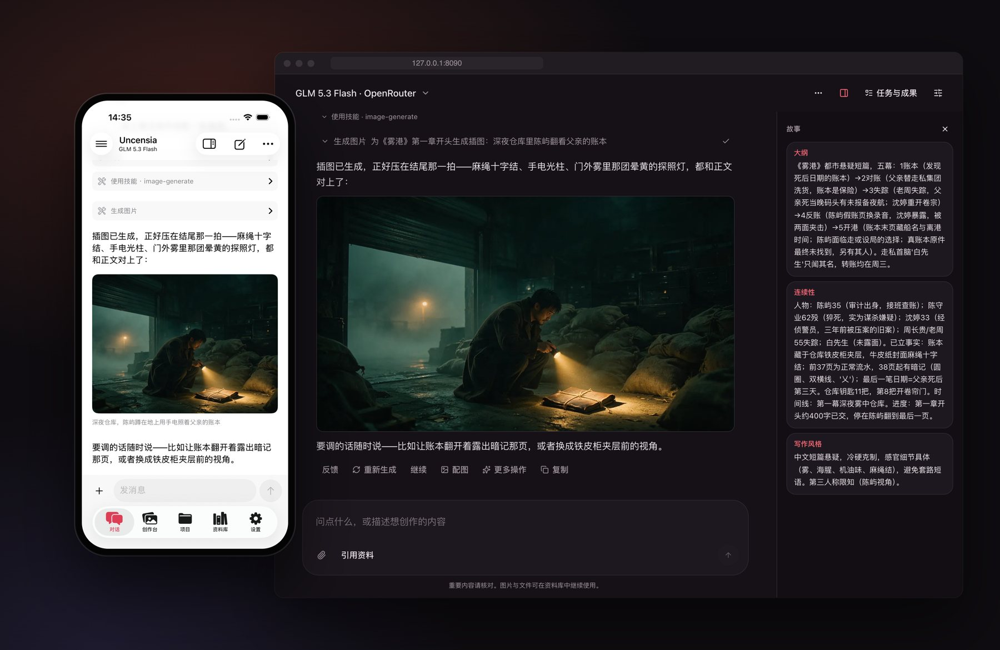
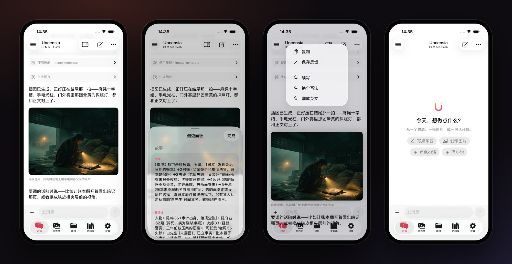
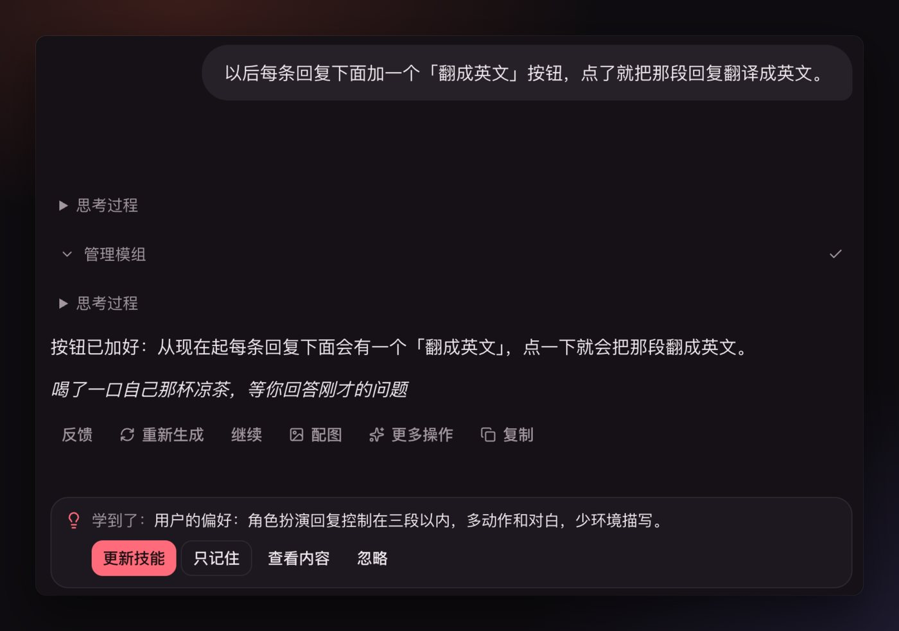
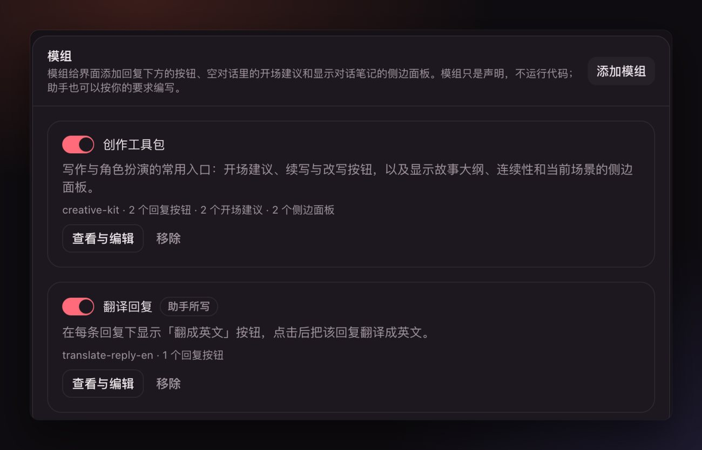

<div align="center">


# Uncensia

**你自己部署的无审查版 ChatGPT。**

什么都能聊，写小说、角色扮演、配图、改图、做视频——而且越用越懂你。<br/>
你的服务器，你的 Key，你说了算。网页与 iPhone 原生 App 都有。免费、开源。


[English](README.md) · [快速开始](#快速开始) · [1.1 新功能](https://github.com/s-JoL/Uncensia/releases/tag/v1.1.0) · [创作指南](uncensia/docs/guide.md) · [文档](uncensia/docs/README.md)

<br/>



<sub>真实会话，没有摆拍：GLM 5.3 Flash 写正文并维护故事笔记，Seedream 5.0 Pro 画插图。</sub>

</div>

## 为什么用 Uncensia

- **什么都能聊。** 没有应用层过滤，没有屏蔽词，也没有额外塞进去的拒答提示。模型愿意写什么，只取决于你选的模型和服务商——换模型一键就行。
- **为创作而生。** 会自己记大纲和设定的小说、直接读大家常用的角色卡来扮演、每条回复下的“配图”按钮、保持同一张脸的改图、把静图变成短视频。
- **越用越懂你。** 你纠正过一次，助手就会提议记住这条偏好，或者更新它的某个技能。你点了才会生效。
- **不写代码也能改造它。** 跟助手说一句“在回复下面加个翻译按钮”，它就把按钮做成模组，网页和 iOS 上立刻出现。
- **随时随地。** 桌面网页、可添加到主屏幕的手机网页、原生 SwiftUI iPhone App——同一台服务器，同一份历史。
- **真正属于你。** 自托管、单用户。对话、角色与作品都存在你磁盘上的 SQLite 和文件夹里。无遥测，也不用在我们这里注册任何账号。

## 快速开始

安装 **Node.js 24+**，然后：

```bash
git clone https://github.com/s-JoL/Uncensia.git
cd Uncensia/uncensia
npm ci && npm run build && npm start
```

1. 打开 [127.0.0.1:8090](http://127.0.0.1:8090)，用服务器日志里打印的访问码登录。
2. 在 **设置 → 服务** 填入 [OpenRouter](https://openrouter.ai/) 的 Key，点 **测试**——它会发一次极短的真实请求确认可用。到这一步就能对话、写作、角色扮演了。
3. 再填一个 [Siray](https://siray.ai/) 的 Key 就能生成图片和视频；也可以接你自己的 [ComfyUI](https://github.com/Comfy-Org/ComfyUI) 显卡。

在手机上打开同一个地址，选“添加到主屏幕”即可。[后台运行、远程访问、更新与备份 →](uncensia/docs/12-operations.md)

## 写一部会自己记事的小说

说一句“我们来写个悬疑故事”。助手先给出大纲，然后随着故事推进维护三条简短笔记——**大纲**（整体走向和写到了哪）、**连续性**（人名、伤势、谁知道什么、时间线）和**写作风格**（你们定下的语气）——显示在正文旁边的“故事”面板里，好让第十二章依然对得上第二章。

每条回复下面都有：**续写**、**换个写法**，以及**配图**——把这一段直接画成插图，放在故事里。写完可以把整个对话导出成 Markdown。

<p align="center">

</p>

## 用你已有的角色卡来扮演

拖进一张角色卡——**PNG**（`chara` / `ccv3`）或 JSON，V1 到 V3 都行——先预览里面有什么，再开始。开场白和世界书会一起带进来。也可以完全不设置，直接描述场景。在这里，角色扮演只是一种聊天方式，不是单独的模式：戏演到一半问个正常问题，会得到正常回答，然后再回到故事里。

## 它会学习——但先问你

<p align="center">

</p>

在你纠正、重写或反馈过某条回复之后，助手会提议**一件**值得保留的事：一条要记住的偏好、一个新技能、对已有技能的一处修正，或一个模组。它会用大白话显示在回复下方——**更新技能**、**只记住**、**查看内容**或**忽略**。学到的一切都有版本记录，可以在设置里一键恢复。

## 模组：说一句就能改界面

模组可以在回复下方加按钮、在新对话里加开场建议，或者加一个侧边面板显示助手维护的笔记。模组只是一小段声明、不运行任何代码，所以助手可以放心地按你的要求来写。默认启用的 **创作工具包** 提供写小说和角色扮演的开场建议、**续写**、**换个写法**，以及“故事”和“场景与关系”两个面板。

<p align="center">

</p>

## 对话背后是真正的智能体

助手可以联网搜索和检索资料库、跨对话记忆、调用 MCP 工具、生成和编辑图片与视频，还能在你离开时按计划把任务继续推进。技能——它写小说、角色扮演、做系列插图等时遵循的流程——都是可以直接阅读和修改的普通文件。读写本机文件与执行命令属于**开发者工具**，默认关闭，需要时再打开；破坏性操作仍会暂停等你批准。

## 用 Uncensia 做的作品

下面每一张图都是 Uncensia 自己管线的**真实产物**——同样的模型、同样的任务队列——提示词、模型 ID 与 SHA-256 见[制作说明](uncensia/docs/showcase/README.zh-CN.md)。

<table>
<tr>
<td width="25%"></td>
<td width="25%"></td>
<td width="25%"></td>
<td width="25%"></td>
</tr>
<tr>
<td align="center">绘本水彩</td>
<td align="center">维多利亚油画</td>
<td align="center">写实电影</td>
<td align="center">柔和动漫</td>
</tr>
</table>

### 同一个角色，一幕接一幕

一次文生图定下场景，再对**第一张图**做两次编辑，换动作、换地点——福尔摩斯和华生始终认得出来。这种视觉连续性，正是给超过一张图的故事配插图时最难的部分。

<table>
<tr>
<td width="33%"></td>
<td width="33%"></td>
<td width="33%"></td>
</tr>
<tr>
<td><b>1.</b> 文生图：贝克街 221B。</td>
<td><b>2.</b> 同一房间，福尔摩斯举起放大镜。</td>
<td><b>3.</b> 同样两个人，走进雾里。</td>
</tr>
</table>

### 一位始终是同一个人的“搭档”

角色设计一次，就能跨心情、服装和地点保留下来——她的脸、雀斑和小星星项链，从雨天咖啡馆到霓虹街头再到家里的安静夜晚。再交给模型**两张**肖像，它就能把两个人合成进同一个新场景。

<table>
<tr>
<td width="20%"></td>
<td width="20%"></td>
<td width="20%"></td>
<td width="40%"></td>
</tr>
<tr>
<td>雨天咖啡馆。</td>
<td>霓虹夜色。</td>
<td>回家的晚上。</td>
<td>与另一张肖像<b>合成</b>。</td>
</tr>
</table>

### 给一本书配图，再修掉不对的地方

上传一本公版小说，找到一章，配上插图。疯帽子茶会的第一张水彩多画了**一块**怀表，再改一次——*“只留一块表，贴在帽匠耳边”*——道具就修好了，场景没有重画。

<table>
<tr>
<td width="25%"></td>
<td width="25%"></td>
<td width="25%"></td>
<td width="25%"></td>
</tr>
<tr>
<td>找到这一幕，配图。</td>
<td>第一次：多了一块表。</td>
<td>改一次：修好了。</td>
<td>继续下一拍。</td>
</tr>
</table>

### 从一张静图到一段镜头

本地 ComfyUI 显卡生成人物，图生图换个地点，再用图生视频让她动起来——全部来自同一个资料库。

<p align="center">

</p>

## 自带模型

新安装开箱就有一套能用的默认配置；在 **设置 → 服务** 填 Key，随时更换任何一项。

| 用途 | 默认模型 | 来源 |
|---|---|---|
| 对话 | **GLM 5.3 Flash**（默认）、**DeepSeek V4.1 Flash**、**MiMo V2.6 Flash**——都能看图 | OpenRouter（你的 Key） |
| 图片——生成、编辑、合成 | **Seedream 5.0 Pro** | Siray（你的 Key） |
| 视频 | **Wan 3.0** | Siray（你的 Key） |
| 图片——本地 | **Lustify V10 Krea Turbo** | 你自己的 ComfyUI |

任何 OpenAI／Anthropic／Gemini 兼容端点、任何 ComfyUI 工作流都能接入。把最常用的几个模型固定下来，一点就能切换。

## 和其他工具比

隔壁都有很优秀的工具，但每一个都只做到一部分：

- **通用对话前端**（Open WebUI、LobeChat、LibreChat、Cherry Studio）聊天体验很好，但生成是外挂，没有角色扮演和视觉连续性，手机上也只是网页。
- **角色扮演前端**（SillyTavern、RisuAI）在角色上很深，但没有会用工具的智能体，生成只是扩展，也没有原生 iPhone App。
- **托管型陪伴 App** 很精致，但托管在别人那里、受审查，也不属于你。

Uncensia 站在它们都没占住的位置：**一个私有、不受限、自带模型的 ChatGPT——有真正的智能体、图文写作与角色扮演、保持一致的图片和视频，还会越用越懂你，网页与原生 iOS 都能用。** 它刻意只服务一个人，这份专注正是重点。

## 常见问题

**需要显卡吗？** 不需要。有 OpenRouter 的 Key（媒体再加 Siray）就全部在云端运行。本地 ComfyUI 显卡是可选的。

**要花多少钱？** Uncensia 免费，MIT 许可。你按用量向各服务商付费，价格以服务商为准。

**真的不审查吗？** Uncensia 自己不加任何过滤、安全 LoRA、屏蔽词表或拒答提示。各服务商仍会执行各自的政策，如何使用由你负责。

**我的数据去了哪？** 存在你机器上的 `uncensia/data/`，以及发给你配置的模型服务商——别无他处。备份时请整个目录一起备份，包括 `master.key`。

**手机上能用吗？** 能：“添加到主屏幕”即可安装网页版，或者用 Xcode 构建原生 iPhone App（[说明](uncensia/docs/15-ios-native.md)）。它不在 App Store 上架。出门在外时，把服务器放在你信任的隧道或反向代理后面。

**能多人共用一个实例吗？** 不能。一个实例归一个人；项目用于整理材料，不是权限边界。

## 开发

```bash
cd uncensia
npm run typecheck
npm run audit
npm run build
```

从[产品范围](uncensia/docs/00-product.md)与[文档索引](uncensia/docs/README.md)开始。iOS App 在 `uncensia/native-ios` 用 Xcode 构建；真实服务商的生成与自动化检查分开验证。

构建于 [Pi](https://github.com/earendil-works/pi)、[React](https://react.dev/)、[Hono](https://hono.dev/)、[ComfyUI](https://github.com/Comfy-Org/ComfyUI) 与 [MCP](https://modelcontextprotocol.io/)。MIT 许可。
