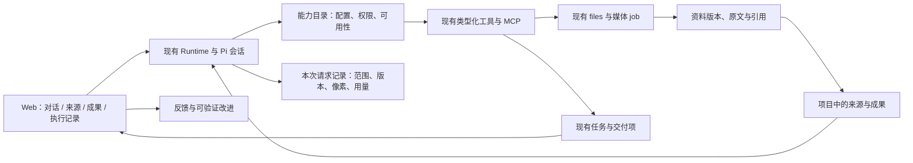

# Uncensia 下一轮优化：对比研究与实施设计

研究日期：2026-09-12，Asia/Taipei。源码基线：`af56e1e5b9f74eb4fad87d0054d59928bb4485e1`；本地 Pi 依赖：`0.85.1`。范围：后端与 WebUI，不含 iOS。

**状态：研究和设计完成，以下优化尚未实现。** 本轮只读检查生产数据库与会话树，执行资料枚举、长文本和 MCP 返回契约的无模型调用诊断，并查阅五个项目/产品的官方资料。没有启动生产服务、改变配置、提交或推送；诊断使用的本地 MCP 子进程已关闭。

## 1. 建议先做什么

Uncensia 已有通用 Agent、多模型、媒体生成、资料库、原文摘录、会话分支和持续任务。下一轮最有价值的工作，是让这些能力可靠地配合：**找全资料 → 读取准确版本 → 完成工作 → 检查结果 → 原样交付 → 跨轮继续 → 从纠正中改进。**

先做资料与历史的完整读取、长工具结果的可恢复保存、逐次模型请求的执行记录、反馈和交付状态的实时刷新；同时修正本次复现的 MCP 失败标记和资源链接丢失。随后增加轻量项目组织、作品版本与预览，再试验工具按需加载。浏览器、外部连接、后台进程和经验改进各做一个可验证的完整用例，避免一次接入很多只有配置入口的能力。

目标不是把五个产品的功能菜单拼起来。保留 Pi 循环、现有模型/生成后端选择、writer prompt、标准 skills 和 MCP；创作规则留在资料与技能里。用户仍可直接开始普通对话，不需要先建立项目或角色卡。

## 2. 本次证据与边界

### 当前本机保留数据

采集于 2026-09-12 14:17。可复现脚本与原始统计位于本机 `run/comparative-research-20260912/collect.mts`、`evidence.json`，不包含在版本提交中。

| 项目 | 本次读取 |
|---|---:|
| 保留会话 / 当前分支消息 | 13 / 726 |
| 原生会话树消息 | 767：91 用户、222 助手、454 工具结果 |
| 当前分支以外的用户节点 | 6；不能当作 6 个独立任务或失败 |
| run | 89：88 completed、1 cancelled |
| 媒体 job | 449：445 succeeded、3 failed、1 cancelled |
| 资料 | 433：415 图片、10 视频、8 文档 |
| 当前分支工具错误 | 3：2 次 edit_image、1 次 file_search |
| 当前分支携带 usage 的助手消息 | 207；说明已有部分用量原始数据，可复用 |
| 后台任务 / MCP 连接配置 | 0 / 0 |
| 当前保存的反馈 / 交付项 / 摘录 / 下载来源 | 均为 0 |

9 月 11 日以来保留了 4 个新 run，均使用 `openrouter-tencent-hy4-preview`。它们对应的 6 条工具装配事件均声明 `modelInput=[text]`，各有 35 个工具，没有 `view_image`。两轮各保存两条装配事件，所以事件条数也不是模型调用次数。

这些是保留数据快照，不是全生命周期统计。与 9 月 11 日旧报告相比，会话和分支集合已有变化，不能把两次数量直接相减作为新增使用率。新能力表为空，不能证明功能失败或用户不需要；只能说明本次保留的自然使用记录还不能证明其效果。上一轮隔离环境的成功验收仍有效，详见 [资料工作流记录](16-resource-workflows.md)，但不能代替上线后的使用结果。

旧审计回读的 23 个纠正/显式选择样本，仍可作为回归素材：错认图中人物和衣着、参考图分工需要用户重申、重复图片充当多项交付、用户要求扩大未完成范围等。它们不是 23 次统一类型的失败，也不是本轮重新打分的满意度样本。

### 本次实际复现的四个契约缺口

1. `list_resources` 的 schema 只有 `query`；调用底层时固定 `limit=50, offset=0`。当前有 433 项资料，Agent 无法用该工具翻到第 51 项。名称搜索仍可用，但不能替代完整枚举。
2. 向 `persistMessage` 输入 80,019 字符的单行工具文本，保存结果只剩 39 字符的截断提示，尾部标记消失。证明超长单行可以整行被舍弃。本次生产消息未检出该截断标记，因此这是合成诊断复现，不能宣称已造成某次真实资料丢失。Pi 的 `bash` 自带溢出文件，不能把它描述成所有工具都没有恢复途径；缺的是统一、持久、可通过资料接口读取的原文引用。
3. 本地 MCP 服务返回 `isError: true`，通过真实 `McpPool` 后正常 resolve，结果不再包含该失败标记。当前 Pi 循环把正常返回记为非错误，所以工具错误状态会失真；文字中的错误说明可能仍被模型读到，不能把它描述成错误正文也全部消失。
4. 同一 MCP 服务只返回 `resource_link`，通过适配层后变成 `content: []`、空 resources。模型得不到原链接。嵌入式 `resource` 和 structuredContent 目前只保留在 details，没有统一可阅读的内容映射，也需要契约测试。

MCP 诊断使用官方 SDK 构建本地 stdio fixture，直接经过现有适配层，未调用 LLM 或外部账户。脚本为同目录 `mcp-probe.mts` / `mcp-fixture.mjs`，结果为 `mcp-evidence.json`。生产 MCP 配置为 0，因此不把这些缺陷归因为现有自然使用中的三次工具错误。

### 未验证的部分

本机 `127.0.0.1:8090` 无监听，浏览器返回连接拒绝。本轮未启动服务；WebUI 判断来自当前源码及上一轮有日期的操作记录，没有本轮实时界面验收。

没有在五个产品里重跑同一组付费任务，也没有重新取得全部 ChatGPT/Claude 私有历史。因此下文是**本地实现审计 + 官方机制对比 + 待验证设计**，不是五方质量排行榜。记忆和上一轮报告用于选取用户常见任务，不能代替今天的产品文档或实测。

## 3. 五个对比对象分别值得学什么

| 对象 | 已核对的机制 | 对 Uncensia 的启发 | 适用边界 |
|---|---|---|---|
| Pi | 默认四个工具 read/write/edit/bash，通过 skills、扩展和 SDK 增加能力 | 保持小核心，复用原生工具与会话树；专用能力按需出现 | 四个是编码核心的默认配置，不能据此删掉媒体身份、资料库和任务协议。[Pi README](https://github.com/earendil-works/pi/blob/main/packages/coding-agent/README.md) |
| Hermes | 工具组、可选执行后端、带 ID 的后台进程管理 | 能力配置用成组的用户语言；长命令可查看、继续和取消 | Hermes 也有广泛工具目录，并非“工具总量少”。其运行后端是可选配置。[Tools & Toolsets](https://hermes-agent.nousresearch.com/docs/user-guide/features/tools) |
| ChatGPT / Codex | 项目组织聊天与来源，文件旁预览和针对局部的修改反馈 | 资料、工作过程、最终文件应在同一工作区中能找到 | ChatGPT 项目、桌面本地项目、Codex CLI 的能力不同，不能混为同一界面。[Projects](https://learn.chatgpt.com/docs/projects)、[Files](https://learn.chatgpt.com/docs/artifacts-viewer) |
| Claude / Claude Code | 项目知识；Cowork 作品版本；Code 的 MCP tool search | 项目内共享资料、作品版本独立于聊天、低频工具延迟加载 | Claude 项目不等于自动继承每段聊天；Code 的延迟工具依赖协议和提供方支持。[Projects](https://support.claude.com/en/articles/9519177-how-can-i-create-and-manage-projects)、[Artifacts](https://support.claude.com/en/articles/14729249-use-artifacts-in-claude-cowork)、[MCP](https://code.claude.com/docs/en/mcp) |
| SillyTavern | Data Bank 的全局/角色/会话范围，World Info 的上下文预算，Prompt Manager 的组件组织 | 创作资料有作用范围，能解释本轮哪些设定进入了上下文 | 借鉴范围和可见性；不把关键词激活、复杂提示模板和全套 RP 配置搬入通用核心。[Data Bank](https://docs.sillytavern.app/usage/core-concepts/data-bank/)、[World Info](https://docs.sillytavern.app/usage/core-concepts/worldinfo/)、[Prompt Manager](https://docs.sillytavern.app/usage/prompts/prompt-manager/) |

另外两点不能只看宣传效果：

- Hermes 的后台复盘可整理记忆和技能，也可暂存供审阅；官方同时说明它会增加 token 开销。因此适合借鉴带来源的改进流程，暂不照搬每轮自动复盘。[Persistent Memory](https://hermes-agent.nousresearch.com/docs/user-guide/features/memory)、[Skills](https://hermes-agent.nousresearch.com/docs/user-guide/features/skills)
- Claude 的工具延迟加载、OpenAI API 对大型工具目录的建议都值得参考；这不表示当前 OpenRouter 模型支持同样的专有协议。先在现有 Pi 工具接口上验证通用方案。[Advanced tool use](https://www.anthropic.com/engineering/advanced-tool-use)、[OpenAI model guidance](https://developers.openai.com/api/docs/guides/latest-model?model=gpt-5.5)

## 4. 当前不足：按用户影响和证据排序

P1 表示应进入下一轮；P2 表示有明确价值，但应在基础契约稳定后推进。

| 编号 | 优先级 | 不足及用户后果 | 当前证据 |
|---|---|---|---|
| F01 | P1 | 资料枚举不能翻页；“把全部相关资料找出来”可能漏项 | `tools/resources.ts` 固定前 50 项；合成调用已复现 |
| F02 | P1 | 历史搜索能找到别的会话，却不能继续读完整原文；长消息只返回开头 1,500 字符，命中处可能在后面 | `search_history` 调全局搜索，`read_resource` 的 entry_id 只读当前会话；没有结果游标或跨会话阅读句柄 |
| F03 | P1 | 一般工具的长结果缺统一原件；后续引用可能只能引用截断历史 | `agent/messages.ts` 在持久化时截断；`loop.ts` 将其写入 Pi 消息替换流程；合成诊断已复现 |
| F04 | P1 | 无法准确回答“模型这一步到底看到什么”；同一 run 的装配事件可重复 | `runtime.ts:427` 记录模型能力和工具名，不记录最终请求的资料范围、像素、版本和工具 schema；6 事件对应 4 run |
| F05 | P1 | 反馈/交付记录不是实时工作界面；“已核验”容易被当成系统质量证明 | `resource-view.tsx` 的 effect 仅依赖 conversation id；状态由模型文本证据决定；没有用户接受/退回状态 |
| F06 | P1 | 多个长期目标共用全局资料、记忆和工作目录，缺项目作用范围 | `schema.sql` 无项目实体；`runtime.ts` 加载全局记忆及已索引文档目录；现有会话视觉设定仍有价值 |
| F07 | P1 | 文件、消息、摘录和作品之间缺统一版本关系，局部改稿后很难比较和继续 | 有不可变摘录、媒体 parent ID 和聊天分支，但没有统一的作品版本入口；不应重复实现已有会话树 |
| F08 | P1 试验 | 工具发现、权限和设置分别维护，低频工具常驻；用户仍难知道某个开关影响什么 | 最近 run 装配 35 工具；`loop.ts` 把已装配工具全激活；“允许上传文件”实际也控制多个资料工具 |
| F09 | P1 契约 / P2 接入 | MCP 失败标记和资源链接丢失；工具发现与浏览器/账户接入仍不完整 | 本地真实 MCP 适配测试复现 isError/resource_link 丢失；pool 只调用一次 listTools；一般资源读取与 elicitation 未接入，Pi 简单询问 UI unsupported |
| F10 | P2 | 长命令、持续任务、生成 job 的恢复和费用控制未形成统一体验 | 已有任务调度、进度和媒体 job；没有通用进程会话入口，任务 maxRuns 明确不是 token/费用预算 |
| F11 | P2 | 能保存技能改动，但缺“某条纠正产生了什么改进、验证后是否更好”的记录 | 已有 learning-history 和独立权限；记录是写入尝试备份，不等于应用成功或效果改善 |
| F12 | P2 | 文档处理仍偏提取文本，覆盖不了全部办公与研究任务 | extract 支持文本/HTML/PDF/DOCX/EPUB；扫描 PDF 无 OCR，表格/幻灯片无专门阅读与版面验收路径 |

F08 的问题不在 35 这个数字本身。本次自然历史的调用集中于生成、编辑、检索和技能读取，但样本偏创作，不能据此删掉尚未使用的编码或任务能力。工具定义的真实 token 开销和缓存命中尚未测量，不给出虚构的“减少 80%”结论。

## 5. 最终目标与最小架构

### 用户应能自然完成的工作

| 用户目标 | 最终体验 |
|---|---|
| 自己找小说/文档并加入资料 | 搜索、获取原件、显示来源与可读状态；按章/页找内容，遇到格式或登录限制给出可操作状态 |
| 找图片再基于图片生成 | 搜索结果成为真实资源；正确的像素和参考角色进入选定后端；原图、结果与实际参数可比较 |
| 再展示之前的一段文字 | 直接引用现成版本，可复制/下载；不用模型重新抄写 |
| 改第二段、保留其余部分 | 局部编辑产生新版本；能比较、恢复，旧链接仍指向旧内容 |
| 做一组作品、明天继续 | 明确哪些已生成、哪些检查过、哪些需要重做；重启后核对已有结果，不重复计数 |
| 接着同一小说/研究/代码项目 | 自动带入该项目已选来源和明确约束；别的项目资料仍可显式查找，默认不混入 |
| 指出一次错误 | 本轮立即使用纠正；长期改进另有范围、来源、修改记录和效果证据 |
| 在 Web 里做 Codex 类工作 | 文件和终端有真实输出；代码 diff、文档预览、待回答事项和暂停点可见 |

新增的是现有实体之间的少量关系和可见状态，不另建 Agent 循环、独立系列创作引擎或第二个向量库。

### A. 资料与原文：把现有六个工具做完整

1. `list_resources` 增加分页和类型/范围条件，返回稳定游标、实际数量及是否还有结果。复用 Store 的查询，不让模型通过改名词猜下一页。
2. `search_history` 返回命中附近的片段、来源会话/分支、时间及可继续读取的引用。默认当前会话，扩大到项目或个人历史由 Agent 明确选择范围；既有用户授权和范围选择应持续生效。
3. 跨会话阅读通过搜索返回的稳定 `history_ref` 进入 `read_resource`，按声明的作用范围校验；保留现有 entry_id 只读当前会话的契约。先支持当前分支，历史分支作为显式选项。不得把未选范围中的文字当当前指令。
4. 在裁剪工具输出前，把需要保留的大文本写成原件，历史存短预览、长度、哈希及资源引用。优先复用 files 和现有读取/引用接口；工具日志默认不挤满用户资料列表。已有 Pi 溢出文件接入同一交付路径。
5. PDF 页码、EPUB 章节和提取器版本作为阅读定位元数据保存。原文件哈希相同，但解析器升级后的文本也可能变化，因此摘录版本不能只标原文件哈希。原文保持原件，提取文本明确标识为派生表示。

原文引用应区分三个成本：**展示已有内容可以省模型输出；理解内容仍可能需要输入 token；新增或改写的文字仍需要生成。** 当前 `quote_resource` 的方向正确，不需要再造一个“让模型复述”的工具。未来办公文件和程序产物也走真实文件引用，前端直接预览。

存储上限定单结果大小、保留策略和引用关系：被摘录、成果或活动任务引用的原件不能被普通清理误删。写入失败要明确返回，不能先丢原文再宣称可恢复。旧历史中已丢失的内容没有可靠原件时，标记不可恢复，不让模型补写冒充原文。

### B. 项目、作品版本与连续创作

轻量项目只需名称、说明、选中的资料/会话、项目指令和可选工作目录。无项目对话继续存在。新增关联到现有 conversations/files，不复制整个数据库或媒体目录。

资源层先增加“同一作品的多个版本”关系：每个版本引用现有不可变文件、来源版本及实际修改任务；不改变历史 `file_`、`img_`、`vid_`、`quote_` 链接语义。旧资源从单版本开始即可，不重写旧聊天。

项目内呈现三类信息：用户固定的约束、待验证的模型推断、实际成果。创作项目可把人物设定、参考图、已确认剧情作为普通项目资料；是否需要读取和更新由技能/Agent 判断。事实来源和所属分支必须可追溯，不能把助手猜测自动写成设定，也不能把虚构经历写入个人记忆。

这是对 ChatGPT 项目组织方式、Claude 的独立作品版本和 SillyTavern 的作用范围的适配。不是复制角色卡启动流程，也不做关键词命中后自动切角色。[ChatGPT 项目](https://learn.chatgpt.com/docs/projects)、[Claude 作品版本](https://support.claude.com/en/articles/14729249-use-artifacts-in-claude-cowork)、[SillyTavern 资料范围](https://docs.sillytavern.app/usage/core-concepts/data-bank/)

### C. 能力目录与工具按需加载

先统一一份能力描述：工具名、来源、用途、所需配置/权限、当前可用状态及原因。运行时和设置页读取同一份结果，避免 UI 显示允许、Agent 实际拿不到，或缺密钥仍看起来可用。

工具发现试验使用当前 Pi 的 `registerTool` 和 `setActiveToolsByName`，不迁移运行框架。建议的候选机制：

1. 保留少量高频工具与简短能力目录，低频管理、额外生成模型和 MCP 工具通过一个发现入口检索。
2. 检索只负责找目录项，Agent 决定加载；加载后依然调用原有精确 schema 的工具。不要改成 `execute(any_json)`，也不要靠用户句子中的关键词自动开生图或 shell。
3. 记录当前会话已加载的工具名和目录版本；在每个新 run 重建时恢复，再与最新权限取交集。状态写入 Pi 会话条目，不能靠跨 run 闭包缓存。撤权在执行时仍复核。
4. 同一会话不要每轮卸载再重排工具。排序、模型、权限变化和 schema 哈希进入请求记录；以实际缓存命中和端到端费用决定是否默认启用。
5. 显式提供“全部已启用工具”和“按需加载”两种配置，先在隔离评测中对照。协议不支持时明确标记，不默默更换模型或借用另一家的专有 tool reference。

Pi 的默认四工具是原生编码入口，Uncensia 的合理常驻集由任务覆盖和测试决定，不在研究阶段强定成四个。已有 read/grep/find/ls 有各自只读与格式契约，不因 bash 能运行同类命令就立即删掉。`save_knowledge` 是新写综合材料、`acquire_resource` 是保存下载原件、`quote_resource` 是冻结已有内容，三者也不是重复操作。

需要先处理的命名歧义是 `import_file`/`publish_file`：前者是资料库到工作目录，后者是工作目录到资料库，不是“导入到资料库/发布到互联网”。先改善显示名称、分组和描述；若以后改内部工具名，保留历史解析，不额外把新旧别名都常驻给模型。

工具定义和提示前缀变化会影响缓存；动态检索还会增加一次发现调用。Claude Code 和 SillyTavern 文档都指出了这类取舍，但不能直接套用其结论来估算本项目收益。[Claude 缓存](https://code.claude.com/docs/en/prompt-caching)、[SillyTavern 历史向量化](https://docs.sillytavern.app/extensions/chat-vectorization/)

### D. 请求证据、交付与反馈

逐次模型请求记录落在 Pi 的实际发送边界，区分工具装配事件与模型请求。至少包含 run、call 序号、模型和参数快照、活动工具/schema 哈希、技能/指令版本、资料与页段、图片 ID 及是否携带像素、压缩边界和用量。复用现有消息 usage；不先搭建外部遥测系统。

记录不应默认复制所有私有正文或 base64。常驻元数据与哈希；需精确排查时，在明确范围的诊断模式保存有保留期限的请求快照。未知计费和缺失 usage 显示“未知”，不能填 0；估算 token 与提供方实报分列。

交付状态至少分开：待完成、已有成果、模型检查记录、用户接受/退回。检查记录指向具体版本和实际操作；“模型有视觉能力”不等于本轮提供了像素，“调用过看图”也不等于画面正确。文本模型可以生成媒体，但视觉检查显示待完成；可使用用户明确配置的视觉检查模型，实际模型必须显示。

交付项与 job/资源版本关联。生成成功可以登记“产物已存在”，是否满足目标仍由检查和反馈决定。一个素材可以被多个作品引用，但同一成品不能被重复计算为多个独立成果。任务恢复先核对现有 job 和资产，网络超时且提交结果未知时，不直接重发付费生成请求。

反馈保存后使当前会话记录失效并刷新；运行结束和交付更新走已有 SSE/状态刷新。对同一 run 的装配记录合并展示，逐次请求使用稳定 call ID。当前页面不要继续用重复 runId 作为多条上下文记录的 React key。

### E. WebUI：按工作对象组织，而不是继续堆设置

默认保留对话主区，右侧在需要时打开三个视图：**资料、成果、执行记录**。

- 资料：当前对话/项目范围，已选来源与状态；搜索、URL 导入、原文定位。错误分“没下载到、不可读、索引失败”，可保存原件但不能伪称可检索。
- 成果：正在处理、最新版本、历史版本；文本差异、图片对比、文件预览与下载。选中一段或一张图发起局部修改，不要求用户抄 ID。
- 执行记录：计划与交付进度、实际调用、当前等待原因、模型输入证据；摘要默认简洁，详细参数按需展开。

设置保留上一轮拆开的读、写、命令、技能、长期指令权限。进一步按“模型与生成”“资料与联网”“本机与外部连接”“记忆与经验”组织；每个能力显示：已配置、已允许、当前模型可用、尚缺什么。底层仍是同一组配置字段，不再维护一套权限。

“允许上传文件”改成能反映实际控制范围的“启用资料库能力”，说明上传、读原件、摘录等受其影响；“检索”另列。技能和长期指令依然独立，保留当前关于本机命令权限的准确说明。

文件预览优先复用成熟组件，HTML 预览与应用界面隔离。先完成 Markdown/文本 diff、图片、PDF，再增加表格/幻灯片的预览；不要为所有格式自写编辑器。ChatGPT 的价值在生成文件可直接查看并给局部反馈，这比只有下载链接更贴近用户工作。[Work with files](https://learn.chatgpt.com/docs/artifacts-viewer)

### F. 外部工具、编码与长任务

浏览器能力先选择一个成熟 MCP/扩展实现，做完“公开页面 → 动态页面 → 登录后页面 → 下载到资料库”的闭环。登录交给真实浏览器登录界面，凭据不放进提示词；站点被阻止时提供准确等待状态。抓取失败不自动升级成具有更大访问范围的浏览器操作。ChatGPT 官方浏览器文档也明确区分登录会话和个人浏览器环境，不能把一个 fetch 工具称为浏览器。[Browser](https://learn.chatgpt.com/docs/browser)

MCP 返回契约先修：将 isError 映射为 Pi 的真实失败状态，保留可读错误说明；resource_link、嵌入式 resource 和 structuredContent 都要有可读、可保存的表示，不能仅塞进模型看不到的 details。收到资源链接不等于已下载其内容，获取仍遵守相同的网络与范围契约。

再补完整工具分页、断连状态、取消和一个确定需要的资源读取用例；账户连接需要真实认证生命周期及重连验收。支持协议不等于邮箱、网盘、金融账户已接入。先交付一个确实有需求的连接，再复用配置模板扩展。

Web 询问先映射 Pi 的 select/input/confirm 这类简单对话框；持久保存等待项、目标 run 和回复，刷新或重启不丢。只在缺少必要信息时等待，已有授权不重复询问；工具审批和一般澄清分开。任意 TUI、自定义终端组件暂不承诺兼容。

长命令复用 Pi bash 的执行和取消能力，再增一个按需启用的进程管理能力：稳定 ID、输出游标、退出码、继续输入、取消。进程并不因数据库记录存在就能在机器重启后继续；若进程已消失，明确中断，依据文件/job 检查点恢复。

执行环境第一阶段只把“本机、工作目录、已有权限”显示准确。需要隔离时再选容器或远程主机，不把目录限制宣传成系统沙箱。Hermes 的后端接口可参考；Claude Code 的沙箱文档明确不支持原生 Windows，不能在这台机器上直接照搬。[Hermes 执行后端](https://hermes-agent.nousresearch.com/docs/user-guide/features/tools)、[Claude 沙箱范围](https://code.claude.com/docs/en/sandboxing)

任务预算先覆盖调用次数、生成数量和可观测的 token；费用已知时再增加费用上限。计数在派发前原子预留，并发、失败、取消后结算；外部价格未知时不能承诺硬美元上限。预算不足表示暂停，不表示目标完成。后台状态中显示最后进展、下一次执行和待处理事项。

### G. 从纠正中改进，而不是自动改所有 prompt

先把一条反馈关联到原请求、工具、成果版本和后续修正；普通纠正立即用于当前工作。只有需要长期复用的经验才整理成记忆、项目说明或技能变更，明确影响范围。

改进记录增加 applied/failed、前后版本、源反馈和验收结果，复用已有 learning-history。提供“建议”“应用”“恢复”入口；如果用户已经授权某类改进，按该授权执行，不反复确认。没有验证证据时叫建议，不叫学会了。

第一版提供按需复盘，暂不默认每轮后台调用模型。以后若启用自动复盘，复用现有调度，设置调用/费用上限，分别统计复盘成本和纠正复发率。本机 GPU 还承担生成工作，后台学习不能无上限抢占资源。Hermes 的后台复盘和技能暂存提供了可借鉴的流程，但不构成 Uncensia 效果已提升的证明。[Hermes 学习流程](https://hermes-agent.nousresearch.com/docs/user-guide/features/memory)

## 6. 先定义测试，再进入实现

### 评测分两层

**契约层**用隔离数据库、本地 HTTP 服务器、固定文件和提供方桩，验证 ID、版本、权限、取消、引用、分页、状态和请求参数。允许确定性断言。

**真实任务层**使用用户原来任务的完整目标及后续纠正，保持模型、后端和参数可追溯。每条先评首次交付，再分开记录新增需求与被迫纠偏。文字需要阅读，图片需要实际看像素，文件需要打开或渲染。已有 HTTP/SDK 检查不能替代这一层。

成人创作使用用户私有样本评估，不把私有素材公开上传。语气、角色一致性、拒绝情况和生成保真单独记录；平台负责上下文、资源和执行契约，不用静默换模型制造成功。

### 回归用例

| 测试 | 输入/操作 | 必须满足的标准 |
|---|---|---|
| T01 资料完整性 | 151 项、同名文件、多个类型；连续分页 | 在约定快照范围内全部可达，不重不漏；并发导入的游标行为明确 |
| T02 历史阅读 | 命中位于消息第 3,000 字；跨会话和历史分支 | 返回命中片段并能读前后文；默认范围不扩张，其他分支需显式选择 |
| T03 长结果 | 80KB 单行、2MB 多行、UTF-8；重启后读取 | 原件哈希不变、尾部可读；历史预览保持上限；普通清理不破坏有效引用 |
| T04 精确引用 | 文件/消息/工具结果摘录，修改源文件，再切分支 | 摘录逐字一致；旧链接不变；模型结果中无第二份全文 |
| T05 文档定位 | PDF 页码、EPUB 章节、显式编码、解析器版本变化 | 定位到实际页章；版本冲突可见；OCR 缺失与索引失败区分 |
| T06 执行快照 | 三次模型调用，中间新增资料/看图/载入工具 | 每次请求都有正确 call ID、schema/资料版本及像素记录；与捕获的实际 payload 一致 |
| T07 工具与设置 | 各权限组合、缺密钥、断开 MCP、会话中撤权 | 界面状态、目录和真实执行一致；历史调用能展示；无静默扩大权限 |
| T08 动态工具 | 0/35/200 项目录，找资料、创作、编码、管理任务 | 所需工具都可发现并使用，参数验证不弱化；与全量模式对照质量/调用数/成本 |
| T09 项目范围 | 两个项目存在冲突设定；普通问答；显式跨项目引用 | 未选项目资料不进入请求；跨项目使用可追溯；普通对话不被固定成角色模式 |
| T10 局部改稿 | 长文只改第二段；检查旧版本和引用 | 其余段落字节不变，diff 准确，旧引用可打开，可恢复 |
| T11 找图再编辑 | 搜索公开素材→入库→看图→选定后端编辑→看结果 | 来源/像素/参考角色/参数准确；实看成品；文本模型不出现虚假视觉检查状态 |
| T12 系列与恢复 | 约定 12 项；失败 1 项；重复 1 图；中断后继续 | 缺项/重复能看见；只补需补部分；区分已有、模型检查、用户接受 |
| T13 反馈闭环 | 保存反馈，不换会话继续工作；第二设备读取 | 记录立即刷新并进入后续可用上下文；不会自动写入全局记忆；版本关系正确 |
| T14 经验改进 | 一次坏反馈、一次验证过的通用教训；应用与回退 | 建议/应用失败/应用成功区分；旧内容可恢复；相同任务复测后再判断改善 |
| T15 MCP 与浏览器 | isError、resource_link、嵌入式资源、结构化结果；tools/list 三页；断连/登录后下载 | 失败状态不丢、结果可读可继续获取；不漏工具；下载有真实原件；未连接时不伪称已访问账户 |
| T16 等待与命令 | 模型询问缺失信息、浏览器刷新、长命令/取消 | 等待项持久；回复只恢复目标 run；输出游标不重复，进程树取消可验证 |
| T17 预算 | 并发生成、提供方超时、价格未知、预算耗尽 | 不超过可保证的次数/数量上限；未知费用可见；未完成任务不会标完成 |
| T18 办公成果 | 表格/文档/演示文件生成和局部修订 | 实际文件存在可打开；渲染检查结构和版面；下载链接不是唯一验收 |
| T19 Web 工作流 | 来源/成果/执行视图，390px 与桌面，刷新与 SSE | 状态更新、键盘可达、无溢出；结果可预览比较；服务不可用时明确显示 |
| T20 兼容回归 | 原配置、旧 ID、旧会话树、模型显式选择 | 原功能继续可用；必要类型、audit、构建、HTTP 回归通过 |

### 用什么指标决定是否更好

以 12 条代表性真实目标作为首批样本，每条保留多轮轨迹；工具加载对照中的关键场景各重复至少 3 次。样本量只支持初步选择，不宣称统计上覆盖所有用法。

- 首次交付达标：按事先列出的验收项人工判断，分母是实际执行的目标数。
- 被迫纠偏：每个目标因漏做、误解、错参考、错误操作产生的额外纠正次数；主动新需求另计。
- 确定性错误：漏项、错误版本、重复计数、伪原文、参数/模型被替换，必须为 0。
- 执行效率：首次有用进展时间、总时间、工具调用、重试次数；同时记录输出规模，避免只靠少做换速度。
- 成本：实际 input/output/cache read/cache write、生成次数；已知价格下计算成本，未知项单列。
- 可恢复性：在准备、调用、取得结果、登记成果四个中断位置验证。外部提交结果未知时不盲目重发。

工具按需加载的初始推广门槛：预定用例无确定性回归，配对任务质量不下降；在大型目录任务中实测输入用量/费用或耗时至少一项有明显收益。可先用 20% 作为预设工程目标，低频发现的额外调用不得让关键短任务变得明显更慢。该数字是待测目标，不是已测结果；达不到时保留全量配置，不为工具数指标强推。

与其他产品的后续对照分两种：同模型可用时比较宿主工作流；ChatGPT/Claude 使用不同模型时比较端到端体验，明确无法把差距全部归于 Agent 框架。没有相同素材和任务轨迹的演示视频不计入成绩。

## 7. 实施批次与停留点

| 批次 | 可独立交付的内容 | 主要改动位置 | 完成后再进入下一步的条件 |
|---|---|---|---|
| A：补齐读取与证据 | F01–F05 与 F09 的 MCP 返回契约：分页、完整原件、正确错误/资源结果、逐请求记录、实时反馈/交付 | resources/tools、agent/messages/runtime/loop、mcp/pool、http/routes/files、resource-view | T01–T07、T13、T15 返回契约部分、T20；重跑小说原文与找图编辑两条真实轨迹 |
| B：项目与成果 | F06–F07、F12 最小预览：项目范围、版本关系、文本 diff/图片/PDF 预览 | store/schema、shared types、prompts/context、files/chat Web 页面 | T09–T12、T18 的已支持格式、T19–T20；跨项目干扰为 0 |
| C：工具与配置简化 | F08：共同能力目录、名称说明、Pi 动态工具对照 | agent/loop/runtime、工具注册、settings/capabilities | T07–T08 与成本记录；只推广实际更好的配置 |
| D：外部和持续工作 | F09–F10：一个浏览器连接、MCP 完整发现、简单询问、进程/预算 | mcp、agent/background、工具与等待 UI | T15–T17；实际接入一个完整外部工作流 |
| E：有证据的改进 | F11：反馈到建议/应用/验证/回退；再扩展办公格式 | learning、feedback、任务调度、成果视图 | T14、T18；改善与额外费用一起报告 |

估计 A 为小到中等改动，B/D 为中到较大改动，C 取决于模型兼容与缓存结果，E 取决于真实评测。没有完整实现与运行前不给精确工期。每批先补失败用例、再实现，最后保留可回退迁移与独立提交；提交、部署、真实验收分别报告。

第一批建议从 **T01/T03/T06/T13，以及 T15 的 MCP 返回契约** 开始。它们对应已经复现的枚举、截断、失败标记/资源链接缺口，以及能从代码明确指出的记录/刷新缺口；不依赖新模型、浏览器账户或新 Agent 框架。

## 8. 本轮明确暂缓的方向

不重写 Pi、不新增默认多 Agent 编排、不让每项任务都强制建项目、不自动把所有历史向量化、不复制 SillyTavern 全套提示配置、不把所有生成后端合并成无类型的万能工具、不为追求全自动默认后台改 prompt。

这些不是永久禁止。只有现有方案在代表性任务中出现明确瓶颈，且替代方案能通过相同验收，才值得增加复杂度。已有会话分支、取消、生成 job、精确 ID、快照引用和独立权限应优先复用。

## 9. 来源、版本与后续复核

所有外部页面均在 2026-09-12 实际检索/打开，均为官方文档或项目官方仓库。网页是滚动文档，访问日期不是发布版本；下次实施前复核涉及的 API 和平台范围。

| 来源 | 用途与版本边界 |
|---|---|
| [Pi README](https://github.com/earendil-works/pi/blob/main/packages/coding-agent/README.md) | 当前默认四工具与扩展定位；本地实施以锁定的 0.85.1 SDK 类型和代码为准 |
| [Hermes Tools](https://hermes-agent.nousresearch.com/docs/user-guide/features/tools) | 工具组、执行后端、进程管理；没有运行 Hermes 对照任务 |
| [Hermes Skills](https://hermes-agent.nousresearch.com/docs/user-guide/features/skills) | 渐进加载、技能修改与暂存机制 |
| [Hermes Memory](https://hermes-agent.nousresearch.com/docs/user-guide/features/memory) | 历史/记忆/复盘与成本边界；不引用其性能宣传为本项目收益 |
| [ChatGPT Projects](https://learn.chatgpt.com/docs/projects) | 项目、聊天和来源组织，区分桌面/CLI |
| [ChatGPT Files](https://learn.chatgpt.com/docs/artifacts-viewer) | 文件预览、局部反馈与交付 |
| [ChatGPT Browser](https://learn.chatgpt.com/docs/browser) | 浏览器和登录会话边界；具体可用性受产品环境影响 |
| [OpenAI model guidance](https://developers.openai.com/api/docs/guides/latest-model?model=gpt-5.5) | 大型工具目录的延迟加载建议；不是建议更换当前模型 |
| [Claude Projects](https://support.claude.com/en/articles/9519177-how-can-i-create-and-manage-projects) | 项目资料与指令；不能推导每段聊天自动全部共享 |
| [Claude Cowork Artifacts](https://support.claude.com/en/articles/14729249-use-artifacts-in-claude-cowork) | 独立作品与版本；页面区分 2026-08-19 前后作品机制 |
| [Claude advanced tool use](https://www.anthropic.com/engineering/advanced-tool-use) | 开发平台工具搜索，区分 API 能力与终端产品 |
| [Claude Code MCP](https://code.claude.com/docs/en/mcp) | 延迟工具和提供方兼容边界；滚动默认值需实施前复核 |
| [Claude Code caching](https://code.claude.com/docs/en/prompt-caching) | 工具/上下文变化对缓存的影响 |
| [Claude Code sandbox](https://code.claude.com/docs/en/sandboxing) | 原生 Windows 与 WSL2 的适用差异 |
| [SillyTavern Data Bank](https://docs.sillytavern.app/usage/core-concepts/data-bank/) | 全局/角色/会话资料及读取/向量化的区别 |
| [SillyTavern World Info](https://docs.sillytavern.app/usage/core-concepts/worldinfo/) | 创作设定范围与预算；不采用其关键词路由 |
| [SillyTavern Prompt Manager](https://docs.sillytavern.app/usage/prompts/prompt-manager/) | 上下文组件的可见性 |
| [SillyTavern Chat Vectorization](https://docs.sillytavern.app/extensions/chat-vectorization/) | 动态历史与缓存的取舍，不将其表述推广成所有 RAG 的定律 |

本地入口：[产品](00-product.md)、[设计原则](09-design-principles.md)、[Pi 宿主边界](07-harness.md)、[上一轮实现与验收](16-resource-workflows.md)。

后续最需要补的证据，是同一组真实任务的首次交付、纠正次数、输入用量和实际成果检查。只有这组证据齐全，才能回答“优化后是否更接近用户在 ChatGPT/Codex 中的体验”。
