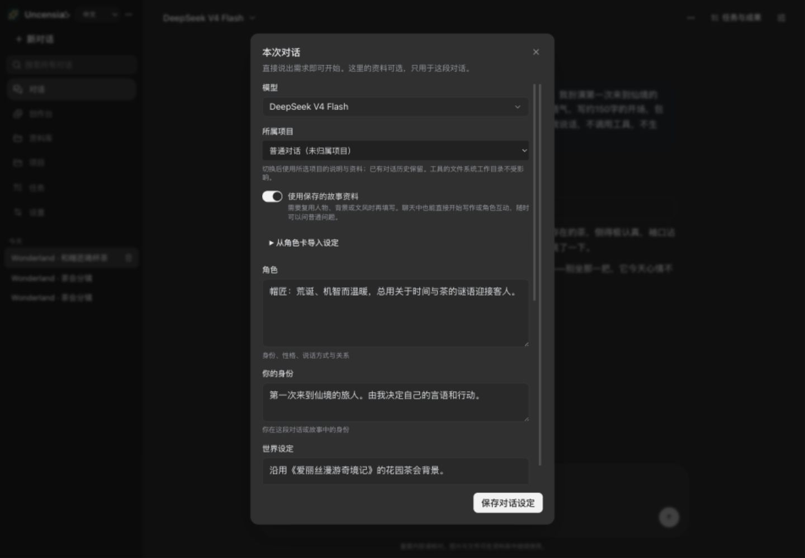

# 创作指南

[文档首页](README.md) · [English](guide.en.md)

Uncensia 把对话、角色扮演、读书配图、图文续写、图片与视频创作放在同一个聊天流里。先在设置中配置可用模型：全新安装已预置对话用的 OpenRouter GLM 5.3 Flash（默认）、DeepSeek V4.1 Flash 与 MiMo V2.6 Flash，图片用 Siray Seedream 5.0 Pro Spicy（生成／改图／合成），视频用 Siray Wan 3.0，另有可选的本地 ComfyUI Lustify V10。默认项不含密钥或模型权重：对话模型负责编排，生成模型负责画面。填好某个托管服务商的密钥即可直接生成；本地 ComfyUI 需要单独安装并准备工作流所需权重，只填对话密钥不会让它自动可用。

## 一切从对话开始

不需要先选择玩法或执行命令。新建对话，直接描述目标——写作、生成图片、读一段上传的文字，或开始一段角色互动。这里可以：

- 附加图片或文档，或点击「引用资料」从资料库带入已有素材。
- 生成过程中随时「停止」，用「转向」改变接下来的方向，或用「回答后」排队下一条要求。
- 对某条消息「编辑」并重新生成，或在「查看版本与分支」里建立分支比较不同走向。
- 对回复留下「反馈」，供这段对话后续参考；对话过长时用「整理上下文」压缩历史。
- 点回复下方的「配图」，把这一段画成插图；顶栏「⋯」里可以「导出为 Markdown」。

新对话的空白页会列出开场建议（「写小说」「角色扮演」等），点一下就把开头填进输入框，接着补充你的设想即可。

对话模型里，标注「可看图」的能看到图片并据此判断；「仅文字」的编排更快，但看不到画面。

## 角色扮演与长期陪伴

新建对话，直接说明角色即可，不需要单独的 RP 模式：

> 我来扮演来到茶会的旅人，你扮演帽匠。沿用原著的荒诞语气，每次回复一小段，给我行动空间，不替我说话或决定行动。从我推开花园门开始。

希望长期复用设定时，点击聊天右上角的「本次对话的设置」，开启「使用保存的故事资料」，填写角色、你的身份、世界设定、场景笔记、写作方式与示例对白。也可以「从角色卡导入设定」：PNG 卡片（`chara` / `ccv3`）或 JSON，V1–V3 都能读；先预览，再保存。开场白会放进场景，第一条回复从那里开始；世界书条目作为常驻设定放进「世界」，不按关键词触发；备选开场白、卡片专属的额外指令和扩展功能不会应用，预览里会逐条说明。临时试玩只写提示词也可以。

个人记忆用于你自己的偏好，可随时编辑和删除；虚构人物的经历应写在故事资料或项目文档里，而不是个人记忆。

## 写小说

点空白页的「写小说」，或者直接说想写什么：

> 我们来写一部都市悬疑短篇《雾港》。先给出五幕大纲和主要人物，再写第一章开头四百字。

长篇会跨很多轮，助手会把状态记在本对话的笔记里，而不是靠记忆硬撑：「大纲」记整体走向和写到了哪，「连续性」记后文必须遵守的事实（人名、地点、伤势、谁知道什么、时间线），「写作风格」记你们定下的语气。笔记显示在右上角「侧边面板」的「故事」里，手机上点同一个按钮会弹出面板。笔记只是辅助：正文和你的修改优先，发现不对可以直接告诉助手改。

每条回复下面的「续写」接着往下写，「换个写法」把这一段换一种写法重来，「配图」给这一段画插图。这些按钮来自默认启用的「创作工具包」模组。

## 读一本书，为一幕配图

可以使用[《爱丽丝漫游奇境记》的公版英文原文](https://www.gutenberg.org/ebooks/11)。它在中外都容易辨认，茶会、兔子洞和花园也适合连续画面。现代译本与插图可能另有版权；公开演示使用原文或自行改写的场景。

1. 在资料库上传 TXT、Markdown 或支持的文档；也可以从聊天输入区添加附件。
2. 长篇创作可先创建项目，加入原文与后续会话，让资料围绕这部作品组织。
3. 在对话中引用原文，要求先定位章节，再生成图片。

> 读取我上传的《Alice’s Adventures in Wonderland》第七章茶会场景。先找出人物、道具和动作依据，再做三张连续插图：茶桌全景、帽匠与怀表的近景、爱丽丝离席。保持人物服装、桌面位置与水彩风格一致。每张图前写一句对应情节，完成三张后检查是否遗漏。

正文引用能保留画面出现的位置；点击图片可以查看、保存和追溯来源。需要修改时引用具体图片：

> 只修改第二张：拉近怀表，保留人物和配色，其余两张不变。

一次生成成功不保证跨图身份完全一致，可以逐张调整。参见[真实制作记录](showcase/README.zh-CN.md)：定位原文、生成与局部改图的完整过程。

## 续写成图文交错的故事

在同一会话接着写，明确篇幅、插图数量和出现位置：

> 从旅人坐下接着写三个短场景。每个场景先写约 150 字，再生成并嵌入一张对应插图，然后继续下一段。沿用茶会人物和水彩风格，不要把所有图片集中在结尾。最后停在一个让我选择的节点。

已有满意插图时也可以明确说「复用这三张，不生成新图」，只改文字和排列。[真实图文截图](showcase/web-alice-story.zh-CN.jpg)使用的是三张已生成终稿。

正文不满意时编辑重试或建立分支。要交付稿件，可以要求把它保存为成果；成果按编号保留版本，修改后旧版仍在，并逐版接受或退回。

## 生成、编辑与合成图片

直接在对话里描述画面即可生成。要改一张已有图片，把它作为原图，说明改哪里、保留哪里；要合成多张，说明每张图贡献什么、放在哪里。附加参考图时，明确它的用途——待编辑原图、人物／主体参考、场景参考、风格参考，或合成素材。放大任意图片后，可直接选择「修改」（作为待编辑原图）或「作为参考」。

> 把这张人物照作为主体参考，生成她站在雨夜市集的全身像，写实 35mm 质感，保持发型和外套。

需要跨多张保持同一形象时，在「本次对话的设置」里开启「使用固定的图片参考」，写下只需长期保持的外貌、服装、场景与镜头事实（视觉圣经），并把满意的成图固定为主体／场景／风格参考（最多三个）。之后说「继续上一张」，就会沿用这里的状态。

## 生成短视频

视频默认使用 Siray Wan 3.0，需要几分钟而非几秒。可以从文字生成，也可以指定一张图片作为首帧让它动起来：

> 用这张站台人物作首帧，生成一段 4 秒、720p、16:9 的短视频：她转身望向站台尽头，镜头缓缓推近，不要声音。

## 创作台与资料库

**创作台**适合自己控制参数：先选创作方式（生成图片／编辑图片／视频）和模型，填写提示词与尺寸，按顺序选择原图（Image 1）和后续素材／参考（从 Image 2 起），提交后在队列查看进度。编辑时可切换「修改原图」或「多图合成」。参数随模型变化；关闭页面或锁屏，任务仍在队列中继续，完成后进入「最近作品」。

**资料库**保存原文、图片、视频和笔记。作品可再次加入聊天、作为编辑原图，或查看来源与创作参数。

## 项目、记忆与成果

- **项目**把说明、资料与多个会话组织在一起；在「本次对话的设置」里可切换所属项目，工具的文件系统工作目录不受影响。
- **个人记忆**保存你的长期偏好，可编辑和删除；虚构经历放在故事资料或项目文档里。
- **成果**是按编号保存的交付快照，保留历史版本；修改后的版本需要你重新查看。

## 后台任务

服务器保持运行时，关闭页面或手机应用不等于停止后台任务。可以安排：只执行一次的任务、朝目标持续推进的任务，或按固定间隔重复的任务。它们使用当前对话所选的模型，在对话空闲时开始，结果回到这里。持续与定期任务可在「任务与成果」入口查看、暂停、继续或取消。

## 越用越懂你：学习建议与模组

你纠正、重写或反馈过某条回复后，助手会在回复下方提议**一件**值得保留的事：一条偏好、一个新技能、对已有技能的修正，或一个模组。点「记住」「更新技能」「只记住」等按钮才会写入，「查看内容」可以先看具体改了什么，「忽略」则什么都不留。助手学会的技能单独列在「设置 → 技能」，每次修改都有版本记录，可以「恢复到修改前」。不想要建议时，在「设置 → 工具与权限 → 持续学习」关掉「学习建议」。

模组给界面添加回复下方的按钮、空对话里的开场建议，以及显示对话笔记的侧边面板。模组只是声明，不运行代码，所以直接跟助手说就行：

> 以后每条回复下面加一个「翻成英文」按钮，点了就把那段回复翻译成英文。

助手写好后按钮立即出现；按钮多于两个时收进「更多操作」。所有模组在「设置 → 模组」里查看、编辑、停用或移除。

## 在手机上用

手机浏览器打开同一个地址，选「添加到主屏幕」，就能像 App 一样全屏使用。

## 在 iOS 接着做

[iOS 客户端](15-ios-native.md) 连接同一个服务器。登录后打开原会话，可以接着阅读、发消息、查看媒体、使用创作台和资料库；开场建议、长按回复出现的模组操作、故事面板和学习建议也都在。手机上的 `127.0.0.1` 指手机自身；连接电脑服务需使用手机可达的服务器地址。参见 [iOS 上的同一段故事](showcase/ios-alice-story.zh-CN.jpg)。
