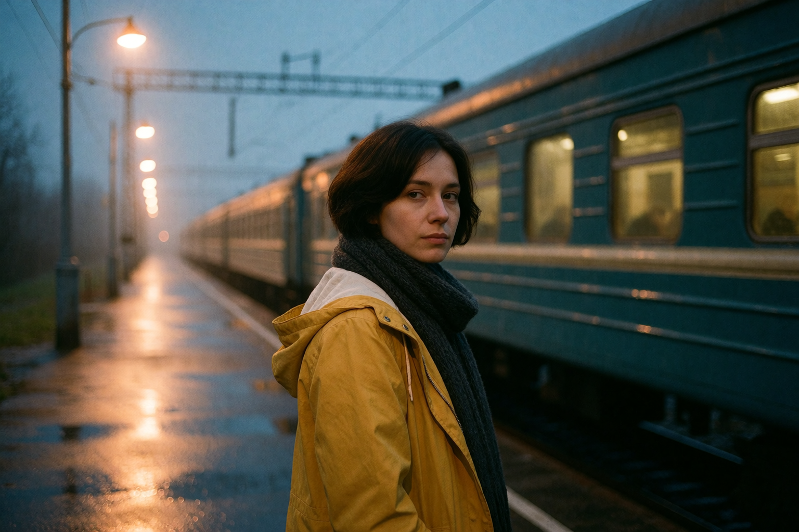
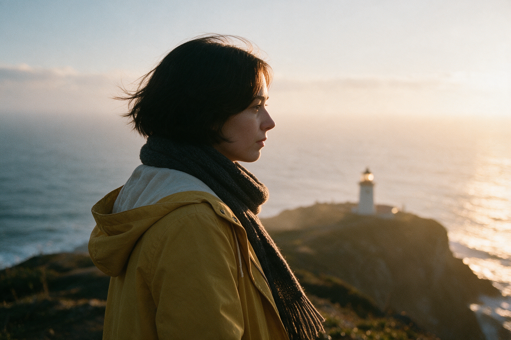
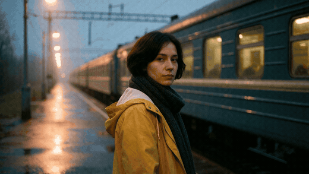

# A small film, made with Uncensia

[English](README.md) · [简体中文](README.zh-CN.md) · [Back to Uncensia](../../../README.md)

The fictional woman in a yellow raincoat was created for this public showcase on 2026-09-08. No private user conversations, memories, reference photos, or existing creations were used.

| Step | Actual backend | Output |
|---|---|---|
| Create the station portrait | ComfyUI · Lustify V10 Krea Turbo | 1536 × 1024 PNG |
| Move the character to the coast | Siray · Seedream 5.0 Pro image-to-image | 1248 × 832 PNG |
| Animate the station portrait | Siray · Wan 3.0 image-to-video | 1280 × 720 MP4, 4 seconds, silent |

[Original video](03-departure.mp4) · [Exact submitted parameters](manifest.json)

## Reproduce it

Configure the corresponding models in Uncensia. For the first image, the packaged ComfyUI workflow needs `lustify_v10_krea_turbo_int8_convrot.safetensors`, `qwen3vl_4b_fp8_scaled.safetensors`, and `wan_2.1_vae.safetensors`, plus the node types declared in the workflow. It uses 8 steps, CFG 1, Euler, beta, and shift 4. The image seed was `9082026`.

1. In Studio, choose image generation and the Lustify model. Copy the first entry’s prompt and dimensions from the manifest.
2. Choose image editing and Seedream. Select the first image as the source; use the second entry’s prompt and `1248x832` size.
3. Choose Wan image-to-video. Use the **station image**, not the coastal edit, as the first frame. Use the final entry’s prompt, 4 seconds, 720p, 16:9, no audio, and no provider prompt expansion.

The asset IDs in the manifest belong to this isolated demo installation; select the equivalent newly generated source in your own installation. Cloud runs may cost money. Provider updates and stochastic generation mean a repeat may differ even with the same settings.

These jobs were submitted through Uncensia’s actual job queue and adapters in an isolated data directory. Both image files were visually inspected; the MP4’s dimensions/duration and representative frames were checked. The edit retains the recognizable hair, coat, scarf, and photographic style, while changing pose and scenery. This is an example, not a benchmark proving identity fidelity across all poses.

The GIF is a smaller animated preview of the MP4. Source images and the original returned MP4 are included separately. The manifest contains public prompts and parameters only; no credentials or provider download URLs.

## Web UI screenshots

`web-studio.png`, `web-studio.zh-CN.png`, and `web-edit.zh-CN.png` are actual Uncensia browser captures from the isolated demo installation, showing the three creations above. Prompt fields illustrate the workflow; capturing them did not submit additional generation jobs. The instance contains no private conversations, and cloud credentials were removed after generation.
